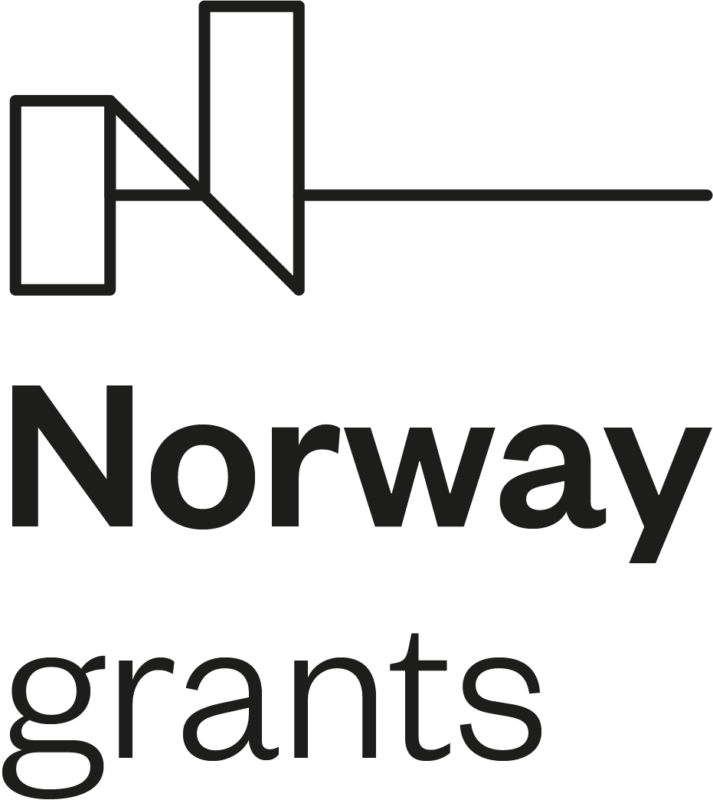

## **Project Partners**

The Office will forge a new partnership with the Norwegian National Human Rights Institution, (i.e. the Norwegian NHRI), which is experienced in promoting human rights approach within its activities. Employees of the Office will visit the Norwegian NHRI in order to obtain know-how and familiarise themselves with best practices and working methods of their Norwegian colleagues.

## Project Summary

Pursuant to Act No. 349/1999 Coll., on the Public Defender of Rights, as amended, the Public Defender of Rights (hereinafter the “Defender”) has, from the very beginning of the institution, protected individuals against acts of selected public authorities and institutions in order to carry out his or her explicit statutory role of contributing to the protection of fundamental rights and freedoms. The Defender is active not only within the framework of maintaining basic lawfulness; in addition to protecting the principles of good governance, the Defender also monitors the observance of rule of law to the extent in which it is inseparably linked with the protection of fundamental rights and freedoms in modern democratic countries. In the years that followed the establishment of the Defender’s institution, new responsibilities closely linked with human rights were added to the Defender’s portfolio, including e.g. protection of persons deprived of liberty, equal treatment and protection against discrimination.

At the present time, the Defender, i.e. the Office of the Public Defender of Rights (hereinafter the “Office”), which provides for the professional, organisational and technical support of the Defender’s activities, has sufficient resources to fund its basic roles and responsibilities. However, the Defender lacks resources to cover a broader range of activities with a society-wide impact aimed at promoting systemic changes.

## Project Goal

The project aims to address this situation by hiring new staff for four of the Office’s departments:

1. The secretariat of the Defender and her Deputy, with the objective of consistent and systematic application of international and constitutional standards of human rights protection in the Defender’s work;
2. The Department of Supervision over Restrictions of Personal Freedom, to strengthen prevention of ill-treatment;
3. The Department of Family, Healthcare and Labour, to strengthen the protection of vulnerable children and their families and to promote the rights of children;
4. The Department of Equal Treatment, to boost the exercise of the right to equal treatment and protection against discrimination.

**This pre-defined project No LP-PDP3-001 is fundend by [Norway Grants 2014 – 2021](https://www.eeagrants.cz/en/programmes/human-rights/general-information)** (programme Human Rights) and will enable to carry out analytical, research and awareness-raising activities helping to improve the situation of vulnerable and marginalised groups, both in terms of protection of their rights and in terms of obtaining the competences necessary to exercise these rights.

The Office will forge a new partnership with the **[Norwegian National Human Rights Institution](https://www.nhri.no/)**, (i.e. the Norwegian NHRI), which is experienced in promoting human rights approach within its activities. Employees of the Office will visit the Norwegian NHRI in order to obtain know-how and familiarise themselves with best practices and working methods of their Norwegian colleagues.

## News

* March 22, 2021 - a clear leaflet for children, which describes who the ombudsman is, in which situations he can help children and how children can turn to them, we have in several language variants. Leaflets can be downloaded [here](https://deti.ochrance.cz/english-po-rysski-deutsch-romanes/).
* January 1, 2021 – we launched the first educational video into the world of social networks. It is a pilot part of a miniseries being prepared, which will present the work of the Ombudsman's office using short videos intended primarily for children and adolescents. You can see the video [here](https://www.youtube.com/watch?v=iiw2OM4jDbA).

* November 18, 2020 – we publish the recommendation of the Deputy Public Defender of Rights regarding the child's contacts in foster care not only with parents [here](https://www.ochrance.cz/uploads-import/Kancelar/projekty/4._MO_1._doporuceni_rodina_VI_6985-20-VOP-PS.pdf). The recommendation aims to contribute to the observance of the rights of children entrusted to foster care. It is primarily intended for parents of children, foster parents, accompanying foster care organizations, organizations assisting parents, social and legal protection bodies for children and courts.
* As of 15 December 2020, for the third monitoring period of the project, we publish the expert outputs of the Secretariat of the Public Defender of Rights and his Deputy. Analysis of nominations for UN Committees you can see [here](https://www.ochrance.cz/uploads-import/Kancelar/projekty/3._MO_1.Analyza_k_navrhovani_kandidatu_do_vyboru_OSN_s_logy.pdf). Comments on the draft amendment to the Public Health Protection Act with regard to the pandemic situation you can see [here](https://www.ochrance.cz/uploads-import/Kancelar/projekty/3._MO_2._51333_2020_MZCR_Ochrana_verejneho_zdravi_pripominky.pdf). Two notifications of the Public Defender of Rights to the Government of the Czech Republic on issues concerning stateless persons you can see [here](https://www.ochrance.cz/uploads-import/Kancelar/projekty/3._MO_3.SZD_32-2020__osoby_bez_statni_prislusnosti_.pdf) and [here](https://www.ochrance.cz/uploads-import/Kancelar/projekty/3._MO_4.SZD_33-2020__osoby_bez_statni_prislusnosti_.pdf). And statement of the Public Defender of Rights on an individual constitutional complaint, in which findings were communicated on certain aspects of the effective investigation of violence against prisoners you can see [here](https://www.ochrance.cz/uploads-import/Kancelar/projekty/3._MO_5.SZD_29-2020-LH_anon.pdf).
* November 10, 2020 – we have prepared another information material for children and youth. A clear leaflet describes who the ombudsman is, in which situations can help children and how children can turn to him. You can see the leaflet [here](https://deti.ochrance.cz/aktuality/jsme-tu-pro-tebe-i-v-teto-dobe/).
* As of 15 August 2020, for the second monitoring period of the project, we publish the expert outputs of the Secretariat of the Public Defender of Rights and his Deputy. Proposal to the Constitutional Court you can see [here](https://www.ochrance.cz/uploads-import/Kancelar/projekty/2._MZ_1_vyjadreni_k_navrhu_logo_KVOP.pdf). And statements for UN experts – Protecting human rights during and after the COVID-19 in the Czech Republic you can see [here](https://www.ochrance.cz/uploads-import/Kancelar/projekty/2._MZ_2_Czech_Republic_join_questionnaire_COVID_Report_s_logy.pdf).
* On July 29 2020, we held internal training for lawyers of the Office of the Public Defender of Rights.

* In July 2020, we created a special easy read leaflet to improve children's awareness of their rights and obligations. You can see the leaflet [here](https://deti.ochrance.cz/decak/).
* On 23 June 2020, we started series of educational seminars for employees, this time for social workers. The first topic was selected questions and answers in the field of social and legal protection and alternative family care. You can see the other informations [here](https://www.ochrance.cz/uploads-import/Kancelar/projekty/06_23_Vybrane_otazky_a_odpovedi_ze_socialne-pravni_ochrany_a_nahradni_rodinne_pece_POZVANKA.pdf).

* As of 15 April 2020, for the first monitoring period of the project, we publish the expert outputs of the Secretariat of the Public Defender of Rights and his Deputy. Statement to the UN Committee on Social, Economic and Cultural Rights you can see [here](https://www.ochrance.cz/uploads-import/Kancelar/projekty/Report_Commitee_on_ESC_rights_s_logy.pdf). Statement of the Public Defender of Rights on the cassation complaint to the Supreme Administrative Court you can see [here](https://www.ochrance.cz/uploads-import/Kancelar/projekty/2._Amicus_curiae_k_NSS_jen_logo_KVOP.pdf). Statement of the Deputy Public Defender of Rights as a conflict guardian on a constitutional complaint addressed to the Constitutional Court you can see here](https://www.ochrance.cz/uploads-import/Kancelar/projekty/3.Vyjadreni_US**opatrovnictvi_ZVOP_final_jen_logo_KVOP.pdf "Opening in a new window") (409.8 kB, Adobe Acrobat document). Comments in the legislative process on the draft law on identity cards you can see here](https://www.ochrance.cz/uploads-import/Kancelar/projekty/4._Postaveni_rodinnych_prislusniku_obcanu_CR**final__jen_logo_KVOP.pdf. And annexes to the Ombudsman's report for the Chamber of Deputies for the 4th quarter of 2019 you can see [here](https://www.ochrance.cz/uploads-import/Kancelar/projekty/6._2678-2020_zprava_ombudsmanky_2019_IV.Q_10_let_ombudsmana-equality_body_en_jen_logo_KVOP.pdf).
* On 5 March 2020, we started series of educational seminars for employees of facilities detainig person subject to resricted personal freedom. The first topic were findings during the visits to the facilities for children requiring immediate assistance. Seminar was opened by the speech of the Deputy to the Public Defender of Rights Monika Šimůnková. You can see the other informations here](https://www.ochrance.cz/uploads-import/Kancelar/projekty/TZ-projekt*lidska_prava*-_seminar_en_final.pdf.

* On 15 January 2020, we organized an opening press conference where the Public Defender of Rights Anna Šabatová introduced the project Strengthening the Public Defender of Rights’ activities in human rights protection. Present journalists were informed about its goals and international cooperation. You can see the press release [here](https://www.ochrance.cz/en/news/press-releases-2020/plan-to-expand-the-human-rights-activities-of-the-public-defender-of-rights/).

<https://www.eeagrants.cz/en/>