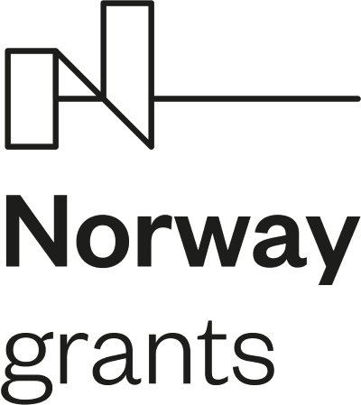
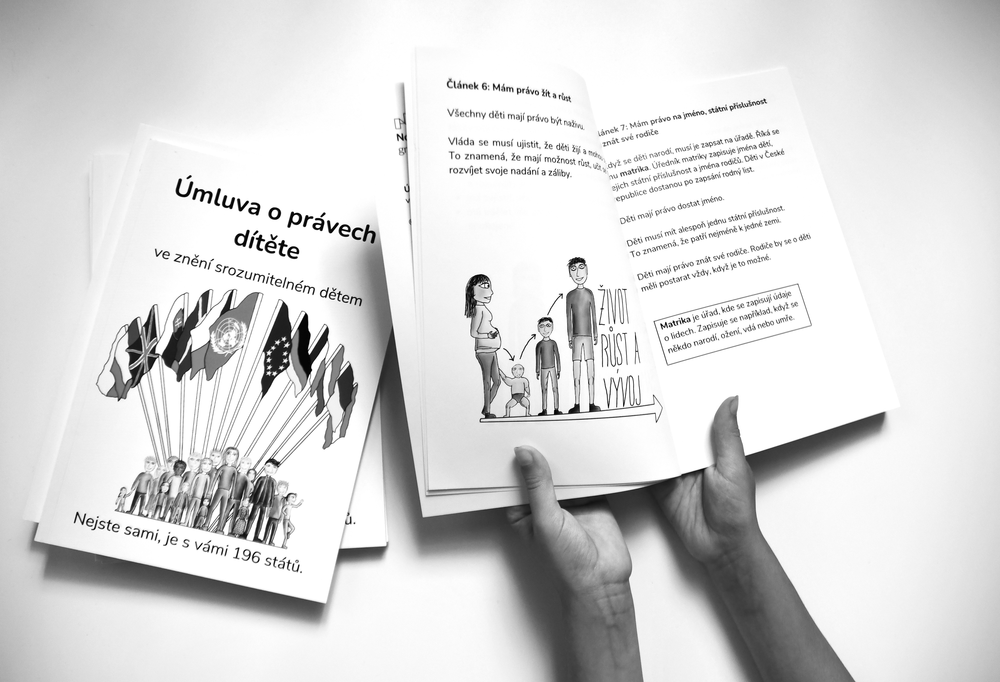
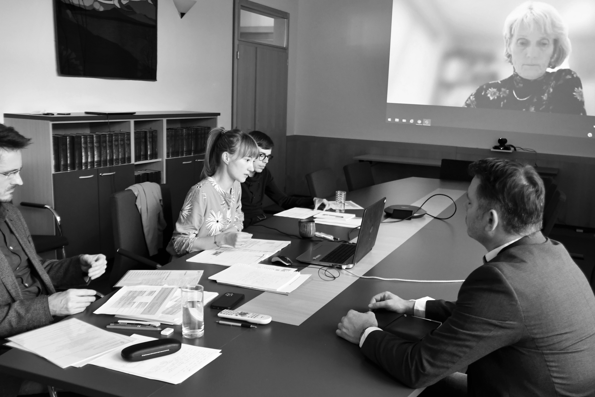
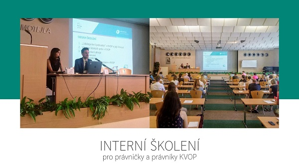
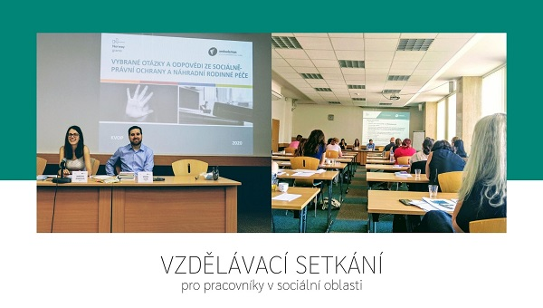
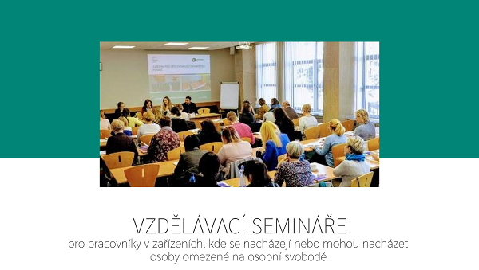

<h2><strong>Project Partners</strong></h2>

The Office will forge a new partnership with the Norwegian National Human Rights Institution, (i.e. the Norwegian NHRI), which is experienced in promoting human rights approach within its activities. Employees of the Office will visit the Norwegian NHRI in order to obtain know-how and familiarise themselves with best practices and working methods of their Norwegian colleagues.

<h2>Project Summary</h2>

Pursuant to Act No. 349/1999 Coll., on the&nbsp;Public Defender of Rights, as amended, the&nbsp;Public Defender of Rights (hereinafter the&nbsp;&ldquo;Defender&rdquo;) has, from the&nbsp;very beginning of the&nbsp;institution, protected individuals against acts of selected public authorities and institutions in order to carry out his or her explicit statutory role of contributing to the&nbsp;protection of fundamental rights and freedoms. The&nbsp;Defender is active not only within the&nbsp;framework of maintaining basic lawfulness; in addition to protecting the&nbsp;principles of good governance, the&nbsp;Defender also monitors the&nbsp;observance of rule of law to the&nbsp;extent in which it is inseparably linked with the&nbsp;protection of fundamental rights and freedoms in modern democratic countries. In the&nbsp;years that followed the&nbsp;establishment of the&nbsp;Defender&rsquo;s institution, new responsibilities closely linked with human rights were added to the&nbsp;Defender&rsquo;s portfolio, including e.g. protection of persons deprived of liberty, equal treatment and protection against discrimination.

At the&nbsp;present time, the&nbsp;Defender, i.e. the&nbsp;Office of the&nbsp;Public Defender of Rights (hereinafter the&nbsp;&ldquo;Office&rdquo;), which provides for the&nbsp;professional, organisational and technical support of the&nbsp;Defender&rsquo;s activities, has sufficient resources to fund its basic roles and responsibilities. However, the&nbsp;Defender lacks resources to cover a&nbsp;broader range of activities with a&nbsp;society-wide impact aimed at promoting systemic changes.

<h2>Project Goal</h2>

The project aims to address this situation by hiring new staff for four of the&nbsp;Office&rsquo;s departments:

<ol>
	<li>The secretariat of the&nbsp;Defender and her Deputy, with the&nbsp;objective of consistent and systematic application of international and constitutional standards of human rights protection in the&nbsp;Defender&rsquo;s work;</li>
	<li>The Department of Supervision over Restrictions of Personal Freedom, to strengthen prevention of ill-treatment;</li>
	<li>The Department of Family, Healthcare and Labour, to strengthen the&nbsp;protection of vulnerable children and their families and to promote the&nbsp;rights of children;</li>
	<li>The Department of Equal Treatment, to boost the&nbsp;exercise of the&nbsp;right to equal treatment and protection against discrimination.</li>
</ol>

<strong>This pre-defined project No LP-PDP3-001 is fundend by&nbsp;<a href="https://www.eeagrants.cz/en/programmes/human-rights/general-information">Norway Grants 2014 &ndash; 2021</a></strong>&nbsp;(programme Human Rights) and will enable to carry out analytical, research and awareness-raising activities helping to improve the&nbsp;situation of vulnerable and marginalised groups, both in terms of protection of their rights and in terms of obtaining the&nbsp;competences necessary to exercise these rights.

<ul>
	<li><a href="http://www.norskefondy.cz">www.norskefondy.cz</a></li>
	<li><a href="http://www.eeagrants.org">www.eeagrants.org</a></li>
</ul>

The Office will forge a&nbsp;new partnership with the&nbsp;<strong><a href="https://www.nhri.no/">Norwegian National Human Rights Institution</a></strong>,&nbsp;(i.e. the&nbsp;Norwegian NHRI), which is experienced in promoting human rights approach within its activities. Employees of the&nbsp;Office will visit the&nbsp;Norwegian NHRI in order to obtain know-how and familiarise themselves with best practices and working methods of their Norwegian colleagues.

<h2>News</h2>

<ul>
	<li>
	
March 1, 2023 - on the occasion of Zero Discrimination Day, which falls on March 1., we are launching the first module of the online course, which is focused on anti-discrimination law. You can read more in the press release <a href="https://www.ochrance.cz/aktualne/jak_poznat_a_resit_diskriminaci_naucte_se_to_v_novem_e-learningu_ombudsmana/">here</a> and view the course <a href="https://diskriminace.netventic.net/login">here</a>.

	</li>
</ul>

<h2>What we implemented as part of the project in 2022</h2>

<ul>
	<li>
	
December 15, 2022 - for the 8th monitoring period, we publish the professional outputs of the Secretariat of the Defender and his deputy. These are sanctions materials against the government (<a href="https://www.ochrance.cz/projekty/posileni-aktivit/ii-material_szd-24-2022-cb_mlade_buky.pdf">unregistered Mladé Buky social services facility</a>), statement of an intervener in the proceedings before the ECtHR (<a href="https://www.ochrance.cz/projekty/posileni-aktivit/szd_9-22_vyjadreni_k_eslp_eng.pdf">unregistered Mladé Buky social services facility</a>) and two materials related to the defender&#39;s legislative comments, namely <a href="https://www.ochrance.cz/projekty/posileni-aktivit/63068_22_priloha_pripominky_zakon_o_vykonu_tos.pdf">the amendment of the Act on the Execution of Imprisonment Sentences</a> and further the so-called <a href="https://www.ochrance.cz/projekty/posileni-aktivit/55974-2022_lex_ukrajina_iv.pdf">Lex Ukraine IV</a>.

	</li>
	<li>
	
October 19, 2022 - The ombudsman has long been devoted to the comprehensibility of documents, so that people understand what he writes to them. We examine why some official texts are comprehensible to the public and others not, what the biggest difficulties are and whether we can fix them. That is why we organized a round table on 14th of October 2022 where we could discuss this topic with experts. You can find the press release on the activity <a href="https://www.ochrance.cz/aktualne/urednici_i_soudci_se_na_kulatem_stole_u_ombudsmana_shodli_ze_uredni_pisemnosti_maji_byt_srozumitelne_pro_ctenare/">here</a>.

	</li>
	<li>
	
October 19, 2022 - we are publishing the sixth report from the Follow-up visit to the facility, from the Louny Children&#39;s Psychiatric Hospital. The report is available <a href="https://www.ochrance.cz/uploads-import/ESO/NZ%2026-2021_DPN%20Louny.pdf">here</a>.

	</li>
	<li>
	
October 12, 2022 - we publish Recommendations regarding the search for general foster parents and adopters for children in foster care for a transitional period in 2021 here. When dealing with individual complaints, we repeatedly encounter a non-uniform approach by the regional authorities of the Czech Republic when searching for general foster parents and adopters for children who are in foster care for a temporary period. We have therefore decided to start an investigation on our own initiative and through research to examine more closely the procedure of regional authorities and municipal authorities of municipalities with extended powers. The research report Analyzing the files of children in transitional foster care is available <a href="https://www.ochrance.cz/uploads-import/ESO/v%C3%BDzkumn%C3%A1%20zpr%C3%A1va%206324-2021_new.pdf">here</a>.&nbsp; &nbsp; &nbsp; &nbsp; &nbsp; &nbsp; &nbsp; &nbsp; &nbsp; &nbsp; &nbsp; &nbsp; &nbsp; &nbsp; &nbsp; &nbsp; &nbsp; &nbsp; &nbsp; &nbsp; &nbsp; &nbsp; &nbsp; &nbsp;

	</li>
	<li>September 27, 2022 - we publish a press release on the status of the project, which has flipped into its second half. You can read about everything we have done in a comprehensive overview <a href="https://www.ochrance.cz/aktualne/projekt_posileni_aktivit_verejneho_ochrance_prav_v_ochrane_lidskych_prav_je_v_polovine/">here</a>.&nbsp;The press release is available <a href="https://www.ochrance.cz/en/aktualne/current_status_of_the_project_reinforcing_the_activities_of_the_public_defender_of_rights_in_the_protection_of_human_rights_with_the_aim_of_establishing_a_national_human_rights_institution_in_the_czech_republic/">here</a>.</li>
	<li>September 2, 2022 - we publish the 5th part of the video with vlogger Anička on the topic of the rights of people with disabilities. You can find the video <a href="https://www.youtube.com/watch?v=JjmnpspcfJM&amp;list=PLWNv_IxgJdEJRcfAUHCC1fZ6J1NiW4qh2&amp;index=6">here</a>.</li>
	<li>September 1, 2022 - we have edited the Convention on the Rights of the Child in a form suitable for a child reader. See more information <a href="https://deti.ochrance.cz/aktualne/chces_konecne_porozumet_umluve_o_pravech_ditete/">here</a>.</li>
</ul>

<ul>
	<li>June 30, 2022 - we publish the 4th part of a video with vlogger Anička on the topic of education. You can find the video <a href="https://www.youtube.com/watch?v=OcKbyR5Nzp0">here</a>.</li>
	<li>June 30, 2022 - we publish a press release that summarizes the topics that arose at the children&#39;s conference. You can find the press release <a href="https://www.ochrance.cz/aktualne/deti_by_chtely_aby_je_dospeli_brali_vazne-_temata_z_prvni_detske_ombudsmanske_konference_budou_moct_podrobneji_probrat_na_navazujicich_workshopech/tiskova_zprava_-_zhodnoceni_detske_konference.pdf">here</a>.</li>
	<li>June 22, 2022 - we publish the 3rd part of the series about the ombudsman for children Anička vlogs. This time the topic is discrimination. You can see the video <a href="https://www.youtube.com/watch?v=GiTQycQaZgM">here</a>.</li>
	<li>June 16, 2022 &ndash;&nbsp; you can see how it turned out at the children&#39;s conference <a href="https://deti.ochrance.cz/aktualne/jak_to_vypadalo_na_nasi_konferenci/">here</a>.</li>
	<li>June 16, 2022 - we publish the 2nd part of the series Anička vlogs, on the topic of Authorities. You can find the video <a href="https://www.youtube.com/watch?v=8wPzjwGk72M&amp;t=3s">here</a>.</li>
	<li>June 15, 2022 &ndash; we are publishing <a href="monitorovaci_zprava_za_rok_2021-en.pdf">the second project monitoring report</a> in the area of fulfilling the right to protection against discrimination for the year 2021.</li>
	<li>June 15, 2022 - as part of education aimed at children, we organized the first ever conference intended for children. Participation in the conference was won by school teams in a creative competition on the topic &quot;How the ombudsman helps children&quot;. Four hundred pupils from 33 elementary schools and multi-year high schools from all over the Czech Republic signed up for it. Among the eighty competition entries were songs, short stories, posters, pictures, poems, presentations or videos, and comics. The young participants discussed topics such as children&#39;s participation in public life or where they look for help in solving various problems, and what they think the children&#39;s ombudsman should do.&nbsp;</li>
</ul>

<ul>
	<li>You can find more information about the conference on the children&#39;s website <a href="https://deti.ochrance.cz/">here</a>, or in the press release <a href="https://www.ochrance.cz/aktualne/deti_na_ombudsmanske_konferenci_zjistovaly_jak_jim_muze_pomahat_verejny_ochrance_prav-_politici_a_odbornici_mezitim_diskutovali_o_detskem_ombudsmanovi/tz_detska_konference.pdf">here</a>, which summarizes all project activities in the field of education aimed at children. And you can watch the press release in video format with subtitles and in sign language <a href="https://www.youtube.com/watch?v=7joyhC2pDgQ">here</a>.&nbsp;The press release is available <a href="https://www.ochrance.cz/en/aktualne/children_found_out_at_the_defender_s_conference_how_the_defender_could_help_them-_in_the_meantime_politicians_and_experts_discussed_the_role_of_a_defender_of_the_rights_of_children/">here</a>.</li>
	<li>June 15, 2022 - the recording of the press conference where we presented the project activities implemented so far in the framework of education aimed at children can be found <a href="https://www.youtube.com/watch?v=frRrDw4p7uc">here</a>.</li>
	<li>June 15, 2022, for the 7th monitoring period we publish the professional outputs of the Secretariat of the Defender and his deputy. These are legislative comments (<a href="https://www.ochrance.cz/projekty/posileni-aktivit/6447_22_priloha_pripominka_k_navrhu_vyhlasky_c_505-2006.pdf">comments of the Defender on the draft decree amending Decree of Ministry of Labour and Social Affairs and Communications No. 505/2006 Coll</a>., which implements certain provisions of the Act on Social Services, as amended). Furthermore, it concerns the statement of an intervenor in the proceedings before the Constitutional Court (<a href="https://www.ochrance.cz/projekty/posileni-aktivit/szd_13-2022_vrbetice_.pdf">proposal for the repeal of selected provisions of Act No. 324/2021 Coll</a>., on one-time compensation of entities affected by an extraordinary event in the Vlachovice - Vrbětice munitions warehouse area and on the amendment of some laws) and the statement of an intervenor in proceedings before the Constitutional Court (<a href="https://www.ochrance.cz/projekty/posileni-aktivit/szd_16-22-vop-vyjadreni_pro_us.pdf">proposal for repeal of &sect; 454, paragraph 1 of Act No. 292/2013 Coll., on special court proceedings, as amended)</a>.</li>
	<li>
	
April 20, 2022, we held a workshop for representatives of ministries and other authorities, some regions and non-profit organizations working with foreigners - EU citizens. The aim of the workshop was to present the results of an extensive survey of EU citizens in the Czech Republic, which found out how EU citizens live in the Czech Republic and what problems they face, and also to discuss the <a href="https://www.ochrance.cz/dokument/obcane_evropske_unie_v_ceske_republice/recommendations-eu-citizens-in-cz.pdf">Defender&#39;s recommendations </a>based on this <a href="https://www.ochrance.cz/dokument/obcane_evropske_unie_v_ceske_republice/survey-eu-citizens-in-cz.pdf">research</a>. Here you can watch a <a href="23_obcane-eu-v-cesku_prezentace-s-doporucenimi.pdf">presentation</a> to get acquainted with the recommendations, a &nbsp;<a href="24_obcane-eu-v-cesku_prezentace-k-realizovanemu-vyzkumu.pdf">24_obcane-eu-v-cesku_prezentace-k-realizovanemu-vyzkumu.pdf</a> on the research and a &nbsp;<a href="25_obcane-eu-v-cesku_prezentace-ds.pdf">presentation</a> within the discussion group.

	</li>
	<li>
	
February 15, 2022 we are publishing a Parenthood and discrimination at work: practical guide for parents regarding their right to equal treatment in the labour market <a href="22_rodicovstvi-a-diskriminace-doporuceni-aj.pdf">here</a>.

	</li>
	<li>
	
February 2, 2022 we are publishing the first Report on the subsequent visit to the facility from the Hrotovice Children&#39;s Home as part of the project. The report is available <a href="https://eso.ochrance.cz/Nalezene/Edit/10324">here</a>.

	</li>
	<li>January 1, 2022 - you can read about the completed research Citizens of the EU in the Czech Republic <a href="https://pravo21.cz/spolecnost/obcane-eu-se-v-cesku-casto-setkavaji-s-diskriminaci-potvrdil-vyzkum-ombudsmana">here</a>.</li>
</ul>

<h2>What we implemented as part of the project in 2021</h2>

<ul>
	<li>
	
December 15, 2021, for the 6th monitoring period, we publish the professional outputs of the Secretariat of the Defender and his deputy. These are <a href="16_sankce-prispevek-na-peci.pdf">sanction material</a> for the government (issues of the currently effective legal regulation of the care allowance),&nbsp; <a href="17_sankce-vyrazeni-z-up.pdf">sanction material</a> for the government (illegal procedure of regional branches of the Labor Office and the Ministry of Labor and Social Affairs in removing jobseekers <a href="18_sankce-dlouhodoby-pobyt.pdf">material</a> to the government (illegal procedure of the OAMP MV when stopping the proceedings on the application for a long-term residence permit), as well as on the <a href="19_vyjadreni_us_94.pdf">statement</a> of the intervener in the proceedings before ÚS (proposal to repeal &sect; 94 letter a) of Act No. 6/2002 Coll. for conflict with the constitutional order), for the <a href="20_vyjadreni_us_111.pdf">statement</a> of the intervener in the proceedings before the Constitutional Court (proposal to repeal selected provisions of Acts No. 111/2006 Coll. and No. 251/2016 Coll. for conflict with the constitutional order), for the GTC report on activities for III. quarter 2021 (inclusion of a separate section containing key information on the current phase of project implementation in the KVOP) and on <a href="21_novela_zakona_o_ssp-pripominky-mpsv.pdf">legislative comments</a> (comments of the GTC on the draft law amending Act No. 117/1995 Coll.).

	</li>
	<li>
	
November 12, 2021, we are publishing an <a href="15_vop-studie-mindbridge-en.pdf">analytical report</a> from the Citizens of the European Union in the Czech Republic survey, the aim of which is to examine the experiences of EU migrant workers and their family members currently residing in the Czech Republic in various areas of life. Following the research report, we publish Recommendations, the purpose of which is to use the findings of the analytical report of the research and the activities of the Defender and on the basis of them to propose individual partial recommendations that would help improve the unsatisfactory situation. The documents can also be found in the Register of Ombudsman Opinions.

	</li>
	<li>
	
October 14, 2021 today we started a three-day online meeting with the Norwegian partner Norges institusjon for menneskerettigheter. We focused the interactive workshop on the topic &quot;Paris Principles in Practice&quot;.

	</li>
	<li>
	
October 8, 2021 we publish an information <a href="13_letak_-_dite_na_psychiatrii_s_nf.pdf">leaflet</a>&nbsp;for children &quot;I am in a psychiatric hospital&quot;.

	</li>
	<li>
	
October 7, 2021 we publish the <a href="12_zprava_o_setreni_a_doporuceni_ve_veci_vyhledavani_obecnych_pestounu.pdf">Recommendation of the Deputy Ombudsman</a> regarding the search for general foster parents and adoptive parents for children in foster care for a transitional period. The aim is to provide the public administration with feedback and recommendations in the area of ​​mediation of foster care and adoption. The individual authorities will be informed about the results, as well as the Ministry of Labor and Social Affairs, which manages the authorities methodically in this area, and is therefore responsible for the possible regulation of fragmented administrative practice.

	</li>
	<li>
	
August 15, 2021&nbsp; for the 5th monitoring period, we publish the professional outputs of the Secretariat of the Defender and his deputy. This is a <a href="9_material_szd_11-2021-cb_sankce_vlade.pdf">sanction material</a> for the government concerning the issue of unregistered facilities providing social services, as well as the <a href="10_2021-szd-jcz-_vyjadreni_k_navrhu_k_us_final.pdf">statement</a> of the intervener in the proceedings on the repeal of the provisions of &sect; 155 para. 4 and para. 5 of Act No. 541/2020 Coll., On waste, as amended. <a href="11_2021-szd-dk_final.pdf">regulations</a>&nbsp;and a motion to the Constitutional Court to annul the provisions of point 80 in the part defined in column 2 of Annex No. 4 to Government Decree No. 278/2008 Coll., on the content of individual trades, as amended

	</li>
	<li>
	
August 12, 2021 we publish <a href="8_doporuceni_detska_psychiatrie.pdf">Recommendations</a> ZVOP Child&#39;s participation in decision-making on matters related to his hospitalization in psychiatry

	</li>
	<li>
	
June 30, 2021, we are publishing a press release to issue the first monitoring report on equal treatment. In the initial monitoring report on equal treatment, we present three areas that the Ombudsman will systematically monitor by 2023. You can find the monitoring report <a href="7_ombudsman-nf_monitor-z-01_en.pdf">here</a>.

	</li>
	<li>
	
April 15, 2021, for the fourth monitoring period of the project, we publish the expert outputs of the Defender&#39;s Secretariat and his deputy. This is a <a href="3-2020-szd-advokatni_tarif.pdf">proposal to the Constitutional Court</a> to annul the provisions of Section 9, Paragraph 5 of Decree No. 177/1996 Coll.&nbsp; <a href="4_vlada_-_vyrazeni_z_uradu_prace.pdf">employment</a>and the statement of the intervener in the proceedings on the annulment of the provisions of Section 52, Paragraph 4 of Act No. 169/1999 Coll., on the Execution of Sentences of Imprisonment. Next in line is the <a href="5_ennhri_questionnare_ecthr_-_third_party_intervention_final_an_update.pdf">ENNHRI questionnaire</a> on the collection of litigation information in the case of Duarte Agostinho and others v. Portugal and others before the ECtHR and the&nbsp;<a href="6_rule-of-law-consultation-2021-questionnaire_cz.pdf">annual report</a>&nbsp;on the state of the rule of law in the Czech Republic in 2020 for ENNHRI.

	</li>
	<li>
	
April 14, 2021 - we publish the <a href="1_doporuceni-ochrance-ve-veci-deinstitucionalizace-pece-o-male-deti.pdf">Ombudsman&#39;s Recommendation on the Deinstitutionalisation of the Care of Young Children </a> and the&nbsp;<a href="2_doporuceni-ochrance-ve-veci-zvyseni-odmen-pestounum-na-prechodnou-dobu.pdf">Ombudsman&#39;s Recommendation on the Increase of Remunerations for Foster Parents for a Transitional Period</a>.

	</li>
	<li>March 22, 2021 - a clear leaflet for children, which describes who the ombudsman is, in which situations he can help children and how children can turn to them, we have in several language variants. The English leaflet can be downloaded&nbsp;<a href="https://www.ochrance.cz/uploads-deti/user_upload/Prilohy/ombudsman_detem/Letak_-_Ombudsman_detem__anglictina_.pdf">here</a>, the German&nbsp;<a href="https://www.ochrance.cz/uploads-deti/user_upload/Prilohy/ombudsman_detem/Letak_-_Ombudsman_detem__nemcina_-_anglicke_logo_.pdf">here</a>, the Romani&nbsp;<a href="https://www.ochrance.cz/uploads-deti/user_upload/Prilohy/ombudsman_detem/Letak_-_Ombudsman_detem__romstina_.pdf">here</a>&nbsp;and the Russian&nbsp;<a href="https://www.ochrance.cz/uploads-deti/user_upload/Prilohy/ombudsman_detem/Letak_-_Ombudsman_detem__rustina_-_anglicke_logo_.pdf">here</a>.</li>
	<li>January 1, 2021 &ndash;&nbsp;we launched the&nbsp;first educational video into the&nbsp;world of social networks. It is a&nbsp;pilot part of a&nbsp;miniseries being prepared, which will present the&nbsp;work of the&nbsp;Ombudsman&#39;s office using short videos intended primarily for children and adolescents. You can see the&nbsp;video&nbsp;<a href="https://www.youtube.com/watch?v=iiw2OM4jDbA">here</a>.</li>
</ul>

&nbsp;

<ul>
	<li>November 18, 2020 &ndash;&nbsp;we publish the&nbsp;recommendation of the&nbsp;Deputy Public Defender of Rights regarding the&nbsp;child&#39;s contacts in foster care not only with parents&nbsp;<a href="https://www.ochrance.cz/uploads-import/Kancelar/projekty/4._MO_1._doporuceni_rodina_VI_6985-20-VOP-PS.pdf">here</a>. The&nbsp;recommendation aims to contribute to the&nbsp;observance of the&nbsp;rights of children entrusted to foster care. It is primarily intended for parents of children, foster parents, accompanying foster care organizations, organizations assisting parents, social and legal protection bodies for children and courts.</li>
	<li>As of 15&nbsp;December 2020, for the&nbsp;third monitoring period of the&nbsp;project, we publish the&nbsp;expert outputs of the&nbsp;Secretariat of the&nbsp;Public Defender of Rights and his Deputy.&nbsp;Analysis of nominations for UN Committees you can see&nbsp;<a href="https://www.ochrance.cz/uploads-import/Kancelar/projekty/3._MO_1.Analyza_k_navrhovani_kandidatu_do_vyboru_OSN_s_logy.pdf">here</a>. Comments on the&nbsp;draft amendment to the&nbsp;Public Health Protection Act with regard to the&nbsp;pandemic situation you can see&nbsp;<a href="https://www.ochrance.cz/uploads-import/Kancelar/projekty/3._MO_2._51333_2020_MZCR_Ochrana_verejneho_zdravi_pripominky.pdf">here</a>. Two notifications of the&nbsp;Public Defender of Rights to the&nbsp;Government of the&nbsp;Czech Republic on issues concerning stateless persons you can see&nbsp;<a href="https://www.ochrance.cz/uploads-import/Kancelar/projekty/3._MO_3.SZD_32-2020__osoby_bez_statni_prislusnosti_.pdf">here</a>&nbsp;and&nbsp;<a href="https://www.ochrance.cz/uploads-import/Kancelar/projekty/3._MO_4.SZD_33-2020__osoby_bez_statni_prislusnosti_.pdf">here</a>. And statement of the&nbsp;Public Defender of Rights on an&nbsp;individual constitutional complaint, in which findings were communicated on certain aspects of the&nbsp;effective investigation of violence against prisoners you can see&nbsp;<a href="https://www.ochrance.cz/uploads-import/Kancelar/projekty/3._MO_5.SZD_29-2020-LH_anon.pdf">here</a>.</li>
	<li>November 10, 2020 &ndash;&nbsp;we have prepared another information material for children and youth. A&nbsp;clear leaflet describes who the&nbsp;ombudsman is, in which situations can help children and how children can turn to him. You can see the&nbsp;leaflet&nbsp;<a href="https://www.ochrance.cz/uploads-deti/user_upload/Prilohy/ombudsman_detem/Letak_-_Ombudsman_detem__anglictina_.pdf">here</a>.</li>
	<li>As of 15&nbsp;August 2020, for the&nbsp;second monitoring period of the&nbsp;project, we publish the&nbsp;expert outputs of the&nbsp;Secretariat of the&nbsp;Public Defender of Rights and his Deputy. Proposal to the&nbsp;Constitutional Court you can see&nbsp;<a href="https://www.ochrance.cz/uploads-import/Kancelar/projekty/2._MZ_1_vyjadreni_k_navrhu_logo_KVOP.pdf">here</a>. And statements for UN experts &ndash;&nbsp;Protecting human rights during and after the&nbsp;COVID-19 in the&nbsp;Czech Republic you can see&nbsp;<a href="https://www.ochrance.cz/uploads-import/Kancelar/projekty/2._MZ_2_Czech_Republic_join_questionnaire_COVID_Report_s_logy.pdf">here</a>.</li>
	<li>On July 29&nbsp;2020, we held internal training for lawyers of the&nbsp;Office of the&nbsp;Public Defender of Rights.</li>
</ul>

<ul>
	<li>In July 2020, we created a&nbsp;special easy read leaflet to improve children&#39;s awareness of their rights and obligations. You can see the&nbsp;leaflet&nbsp;<a href="https://deti.ochrance.cz/jsem/v-domove/">here</a>.</li>
	<li>On 23&nbsp;June 2020, we started series of educational seminars for employees, this time for social workers.&nbsp;The first topic was selected questions and answers in the&nbsp;field of social and legal protection and alternative family care. You can see the&nbsp;other informations&nbsp;<a href="https://www.ochrance.cz/uploads-import/Kancelar/projekty/06_23_Vybrane_otazky_a_odpovedi_ze_socialne-pravni_ochrany_a_nahradni_rodinne_pece_POZVANKA.pdf">here</a>.</li>
</ul>

<ul>
	<li>As of 15&nbsp;April 2020, for the&nbsp;first monitoring period of the&nbsp;project, we publish the&nbsp;expert outputs of the&nbsp;Secretariat of the&nbsp;Public Defender of Rights and his Deputy. Statement to the&nbsp;UN Committee on Social, Economic and Cultural Rights you can see&nbsp;<a href="https://www.ochrance.cz/uploads-import/Kancelar/projekty/Report_Commitee_on_ESC_rights_s_logy.pdf">here</a>. Statement of the&nbsp;Public Defender of Rights on the&nbsp;cassation complaint to the&nbsp;Supreme Administrative Court you can see&nbsp;<a href="https://www.ochrance.cz/uploads-import/Kancelar/projekty/2._Amicus_curiae_k_NSS_jen_logo_KVOP.pdf">here</a>. Statement of the&nbsp;Deputy Public Defender of Rights as a&nbsp;conflict guardian on a&nbsp;constitutional complaint addressed to the&nbsp;Constitutional Court you can see<a href="https://www.ochrance.cz/fileadmin/user_upload/Kancelar/projekty/3.Vyjadreni_US__opatrovnictvi_ZVOP_final_jen_logo_KVOP.pdf">here</a>. Comments in the&nbsp;legislative process on the&nbsp;draft law on identity cards you can see&nbsp;<a href="https://www.ochrance.cz/fileadmin/user_upload/Kancelar/projekty/4._Postaveni_rodinnych_prislusniku_obcanu_CR__final__jen_logo_KVOP.pdf">here</a>. And&nbsp;annexes to the&nbsp;Ombudsman&#39;s report for the&nbsp;Chamber of Deputies for the&nbsp;4th quarter of 2019 you can see&nbsp;<a href="https://www.ochrance.cz/uploads-import/Kancelar/projekty/6._2678-2020_zprava_ombudsmanky_2019_IV.Q_10_let_ombudsmana-equality_body_en_jen_logo_KVOP.pdf">here</a>.</li>
	<li>On 5&nbsp;March 2020, we started series of educational seminars for employees of facilities detainig person subject to resricted personal freedom. The&nbsp;first topic were findings during the&nbsp;visits to the&nbsp;facilities for children requiring immediate assistance.&nbsp;Seminar was opened by the&nbsp;speech of the&nbsp;Deputy to the&nbsp;Public Defender of Rights Monika Šimůnková.&nbsp;You can see the&nbsp;other informations&nbsp;<a href="https://www.ochrance.cz/fileadmin/user_upload/Kancelar/projekty/TZ-projekt_lidska_prava_-_seminar_en_final.pdf">here</a>.</li>
</ul>

<ul>
	<li>On 15&nbsp;January 2020, we organized an&nbsp;opening press conference where the&nbsp;Public Defender of Rights Anna Šabatová introduced the&nbsp;project Strengthening the&nbsp;Public Defender of Rights&rsquo; activities in human rights protection. Present journalists were informed about its goals and international cooperation. You can see the&nbsp;press release&nbsp;<a href="https://www.ochrance.cz/en/news/press-releases-2020/plan-to-expand-the-human-rights-activities-of-the-public-defender-of-rights/">here</a>.</li>
</ul>

&nbsp;

