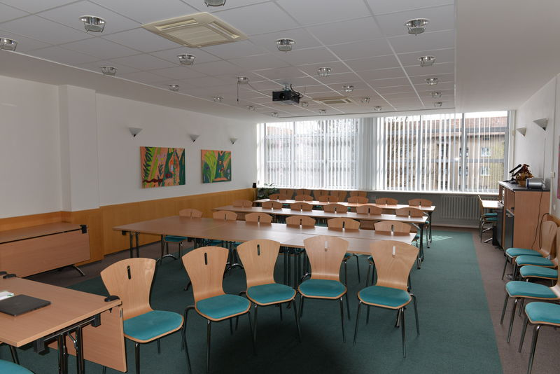

## Velký sál

### Obecné informace o sálu

- Sál je vhodný pro pořádání seminářů, konferencí, koncertů, hudebních programů (solidní akustika), apod.
- Prostor je vybaven stoly + židlemi, pódiem. Max. kapacita při školní úpravě je 144 míst, při koncertní úpravě 216 míst.
- Rozměr sálu: šířka místnosti: 16 m, délka místnosti: 19 m
- Standardní vybavení AV technikou: dataprojektor vč. promítacího plátna, notebook, ozvučení az 7 mikrofony, WiFi, flipchart, klavír
- Sál je klimatizován, možnost zatemnění sálu
- V sále je zákaz konzumace jídla a nápojů
- Pro podání pohoštění či neformální setkání je možno využít předsálí

### Dispoziční možnosti

[Školní úprava](https://www.ochrance.cz/fileadmin/user_upload/img/Saly/VS_skolni_uprava_144_osob.pdf)

[Koncertní úprava](https://www.ochrance.cz/fileadmin/user_upload/img/Saly/VS_koncertni_uprava_216_osob.pdf)

## Malý sál

### Obecné informace o sálu

Sál je vhodný pro pořádání seminářů, konferencí, apod.

- Prostor je vybaven stoly + židlemi. Max. kapacita při školní úpravě je 64 míst, při koncertní úpravě 70 míst.
- Rozměr sálu: šířka místnosti: 8 m, délka místnosti: 17 m
- Standardní vybavení AV technikou: dataprojektor vč. promítacího plátna, notebook, ozvučení – 2 mikrofony, WiFi, flipchart
- Sál je klimatizován
- V sále je zákaz konzumace jídla a nápojů
- Pro podání pohoštění či neformální setkání je možno využít předsálí

## Předsálí

### Obecné informace o předsálí

- K pronájmu sálů se automaticky připočítává pronájem předsálí
- Předsálí je vhodné využít zejména pro prezentace a podání pohoštění
- Rozměr předsálí: šířka místnosti: 10 m, délka místnosti: 21 m
- Uzamykatelná šatna bez obsluhy, toalety, stoly + židle na případné občerstvení účastníků akce
- Z provozně-technických důvodů je možné využít cateringových služeb pouze u našeho provozovatele kantýny. Jde o paní Hanu Kobelkovou, tel: 604 906 046, e-mail: [Hana.Kobelkova@email.cz](mailto:Hana.Kobelkova@email.cz)

## Tiskové středisko

### Obecné informace o tiskovém středisku

- Tiskové středisko je vhodné pro pořádání seminářů, kulatých stolů
- Prostor je vybaven stoly + židlemi, max. kapacita do 25 osob
- Rozměr tiskového střediska:
- Standardní vybavení AV technikou: dataprojektor vč. promítacího plátna, notebook, ozvučení, WiFi, flipchart
- Prostor je klimatizován
- Pro podání drobného pohoštění je možno využít prostoru před TS

## Víceúčelová místnost

### Obecné informace o víceúčelové místnosti

- Víceúčelová místnost je vhodná pro sportovní aktivity (aerobic, jóga, pilates), pro taneční tréninky
- Místnost se nachází v přízemí budovy
- Max. kapacita do 20 osob
- Rozměry místnosti: šířka místnosti: 14 m, délka místnosti: 14 m
- Zrdcadlová stěna
- K dispozici jsou karimatky, činky, overball, aerobic step bedýnky

## [Komerční ceník](https://www.ochrance.cz/fileadmin/user_upload/img/Saly/Cenik_komercni_2020.pdf)

## [Nekomerční ceník](https://www.ochrance.cz/fileadmin/user_upload/img/Saly/Cenik_nekomercni_2020.pdf)

## Kontaktní osoba

Markéta Svobodová

sekretariát vedoucího kanceláře

Tel: 542 542 555

E-mail: marketa.svobodova@ochrance.cz
