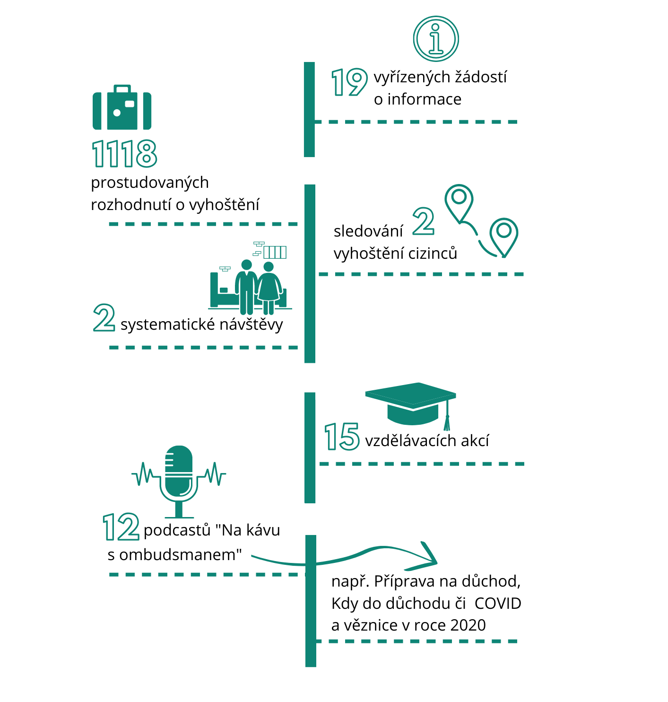

Ombudsman v tomto období také vydal čtyři doporučení – ke sčítání lidu, domů a bytů v roce 2021; k přístupnosti pořadu „Události“ České televize; ke zřizování vyhrazených parkovišť pro osoby se zdravotním postižením a k očkování klientů zařízení zdravotních a sociálních služeb se sníženou schopností rozhodování nebo s podpůrným opatřením.

Ombudsman vybral do zprávy pro poslance jako ukázku své praxe několik případů, kterými se v letošním prvním čtvrtletí zabýval. Mezi nimi byl například problém nesprávně stanoveného důchodu, kdy přesvědčivé určení data vzniku invalidity vedlo k vyššímu důchodu a doplatku či vymáhání nezákonně stanovené daně. Ombudsman také řešil například záležitost cestovních dokladů pro děti v pěstounské péči či vyřizování stížnosti proti postupu poskytovatele zdravotních služeb dozorovým orgánem.

Přehled dalších činností je zobrazen v následující infografice.

