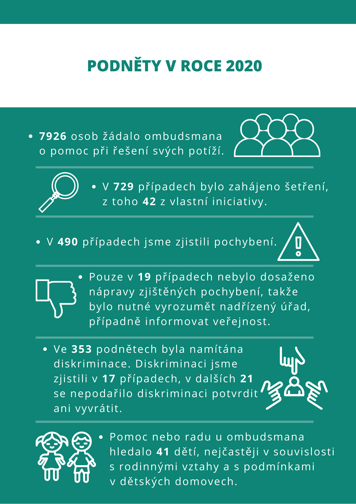

V roce 2020 jsme obdrželi celkem 7926 podnětů, přičemž 68 % z nich bylo v působnosti ombudsmana a mohl se tak jimi zabývat. Tradičně nejvíce podnětů se týkalo oblasti sociálního zabezpečení. Následovala oblast stavebnictví a regionálního rozvoje a dále armády, policie a vězeňství. Oproti předchozímu roku došlo k nárůstu podnětů ve věcech cizinců, přestupků nebo daní, poplatků a cel. 

Podněty, se kterými se lidé v roce 2020 obrátili na ombudsmana, výrazně ovlivnila epidemie COVID-19. Odrazilo se to v množství stížností na postupy cestovních kanceláří u zrušených zájezdů, nastavení pravidel poskytování kompenzačních bonusů nebo dotací, stížností na pravidla pro přijímání žáků na střední školy, uzavření škol a výuku na dálku. Na ombudsmana se obraceli také lidé kvůli omezení přeshraničního pohybu, nebo lidé, kteří namítali diskriminační nastavení některých opatření pro předcházení epidemie.  

Z došlých podnětů jsme v roce 2020 provedli šetření v 671 případech, přičemž ve 490 věcech konstatoval ombudsman pochybení, v 17 případech diskriminaci. Ve většině případů (349) úřady po vydání zprávy o šetření pochybení napravily, v dalších 85 případech úřady chybu nenapravily, ale učinily tak po vydání závěrečného stanoviska s navrženým opatřením k nápravě, které úřad následně přijal. Pouze v 19 případech úřad chybu odmítl napravit a ombudsman tak musel přistoupit k využití sankce, ať už ve formě vyrozumění nadřízeného úřadu nebo v informování veřejnosti. Podali jsme také žalobu ve veřejném zájmu, kterou jsme napadli územní rozhodnutí o umístění výškové budovy Šantovka Tower v Olomouci. Územní rozhodnutí, které žalobou napadáme, umísťuje stavbu na území ochranného památkového pásma městské památkové rezervace Olomouc a může tak nevratně poškodit historické panorama města.

V rámci prevence špatného zacházení se uskutečnilo 21 systematických návštěv zařízení, kde jsou lidé omezeni na svobodě. Byla také vydána zpráva z návštěv domovů pro osoby se zdravotním postižením. Ombudsman realizoval návštěvy také v době epidemie COVID-19. V celkem 13 zařízeních prověřil, jak epidemie zasáhla do života klientů a chodu zařízení, jaká opatření zařízení v souvislosti s epidemií přijala a zda nepřiměřeně nezasáhla do práv pobývajících osob. V žádném zařízení nebylo zjištěno špatné zacházení. Problém jsme však shledali v omezení kontaktu s vnějším světem v podobě zákazů návštěv nebo zákazů vycházení. Speciální pozornost jsme věnovali dětem, pro které jsme vydali dva informační letáky a rovněž jsme se zaměřili na přiblížení práce ombudsmana pro děti prostřednictvím osvětové kampaně. 

V oblasti monitorování práv lidí s postižením jsme v roce 2020 zahájili 3 výzkumy a současně byly 4 další výzkumy dokončeny. Dokončené výzkumy se týkaly rozhodování soudů o omezení svéprávnosti, dostupnosti rané péče pro děti s postižením a dále se jednalo o dva výzkumy pokrývající zaměstnávání lidí s postižením. Vydali jsme několik doporučení, jedno z nich se týkalo ochrany práv rodičů s psychosociálním postižením. Zvolen byl nový poradní orgán (ombudsman jej zřizuje ze zákona), který pomáhá s naplňováním Úmluvy OSN o právech lidí s postižením. Zabývali jsme se také 67 podněty, které poukazovaly na různé systémové nedostatky v oblasti práv lidí s postižením, třeba problém opatrovníků, kteří zanedbávali své povinnosti vůči svěřeným osobám se zdravotním postižením. Opakovaně jsme se zabývali problémy vyřazování uchazečů z Úřadu práce kvůli nemoci. 

Výroční zpráva obsahuje také 13 legislativních doporučení, která se týkají systémových a dlouhodobých problémů. Mezi nimi je například doporučení na zkrácení doby pojištění potřebné pro vznik nároku na starobní důchod; zvýšení odměn pěstounů na přechodnou dobu; deinstitucionalizace péče o malé děti; posílení ochrany spotřebitele v oblasti dodávek energií; stížnostní mechanismus v sociálních službách; nebo zrušení subjektivní lhůty pro zahájení přezkumného řízení.

Ombudsman vznesl v roce 2020 celkem 404 připomínek ke 37 materiálům ministerstev. Takřka polovina připomínek (49 %) byla alespoň částečně akceptována, ve 13 % zůstal rozpor. Nejvíce jsme připomínkovali připravovaný stavební zákon, zákon o ochránci práv dětí nebo novelu zákona o zdravotních službách.

### Časová osa významných momentů


:: Podali jsme žalobu ve veřejném zájmu, kterou jsme napadli územní rozhodnutí o umístění výškové budovy Šantovka Tower v Olomouci.
:: Představili jsme zprávu z návštěv domovů pro osoby se zdravotním postižením. Kromě jiného zde upozorňujeme, že transformace sociálních služeb se téměř zastavila a přestala být společenským a politickým tématem.
:: Ohradili jsme se proti nestandardnímu a nepředvídatelnému postupu Ministerstva pro místní rozvoj v souvislosti s návrhem stavebního zákona.
:: Upozornili jsme na to, že distribuce ochranných pomůcek a jiných prostředků do sociálních služeb či služeb následné péče, které se poskytovaly seniorům, musí mířit i do zařízení, která o seniory pečují, aniž by měla k činnosti potřebná oprávnění.
:: Upozornili jsme ministry, že některá z vládních opatření proti COVID-19 dopadají nepřiměřeně na zranitelné skupiny, zejména na ohrožené rodiny, lidi s postižením nebo jejich pečující.
:: Spolu s Ministerstvem pro místní rozvoj jsme společně oslovili provozovatele cestovních kanceláří a uvedli přesné postupy, jak by se cestovní kanceláře měly v případě rušení zájezdů kvůli pandemii COVID-19 vůči klientovi zachovat.
:: Vydali jsme výzkumnou zprávu mapující, jak obce přistupují k individuálním žádostem o vyhrazené parkování pro osoby se zdravotním postižením. Jen čtvrtina obcí vůči nim projevuje jistou vstřícnost.
:: Zveřejnili jsme zprávu z návštěv zařízení, která reflektovala dobu pandemie COVID-19. Lidé v zařízeních byli v této době někdy úplně „odříznuti“ od okolí. Omezení návštěv, absence kontaktu s blízkými osobami a mnohdy i nemožnost vycházet z objektu patřily k nejproblematičtějším důsledkům opatření proti šíření onemocnění.
:: Osvobození bytu v rodinném domě od daně z nabytí nemovitých věcí lze nově uplatnit zpětně. Lidé, kteří si před 1. listopadem 2019 pořídili byt v rodinném domě, mohou osvobození uplatnit, pokud jim ještě neuplynula lhůta pro stanovení daně. Napravuje se tak několik let trvající nespravedlnost způsobená opomenutím zákonodárce, na kterou jsme dlouhodobě upozorňovali.
:: Připravili jsme informační leták a video, které dětem jednoduchou formou přibližuje činnost ombudsmana a možnosti, jak jim může pomoci. Dále jsme vydali i druhý leták, který je určený dětem umístěným v dětském domově nebo ve výchovném ústavu. Leták se zaměřuje na práva dětí a nejčastější problémy, se kterými se potkávají. 
:: Vydali jsme sborník Stanovisek: Odstraňování staveb II. Jde o aktualizovanou publikaci pro občany i úřady.
:: Apelovali jsme na vládu a politickou reprezentaci, aby se zabývaly postupným prodloužením doby důchodového pojištění až na mimořádně přísných 35 let. Povede to k nárůstu počtu seniorů, kterým nevznikne nárok na starobní důchod.
:: Začali jsme se zabývat stavbou „Nová Masaryčka“ v Praze, abychom prověřili postup úřadů a možné pochybení úřadů.
:: Vydali jsme výzkum, jak o diskriminaci rozhodují české soudy.
:: Zveřejnili jsme výzkum rozhodování soudů o podpůrných opatřeních – soudy nejčastěji volí omezení svéprávnosti. Výzkum analyzoval 256 rozhodnutí soudů z let 2013 až 2019.
:: Spustili jsme podcasty Na kávu s ombudsmanem s radami, jak řešit různé životní situace. 
:: Začali jsme prověřovat činnost orgánů státní správy v souvislosti s úniky závadných látek do řeky Bečvy.
:: Vypracovali jsme doporučení týkající se kontaktu dětí v pěstounské péči s rodiči, sourozenci a dalšími blízkými. Upozorňujeme zde, že zakázat kontakt s rodičem může pouze soud.
