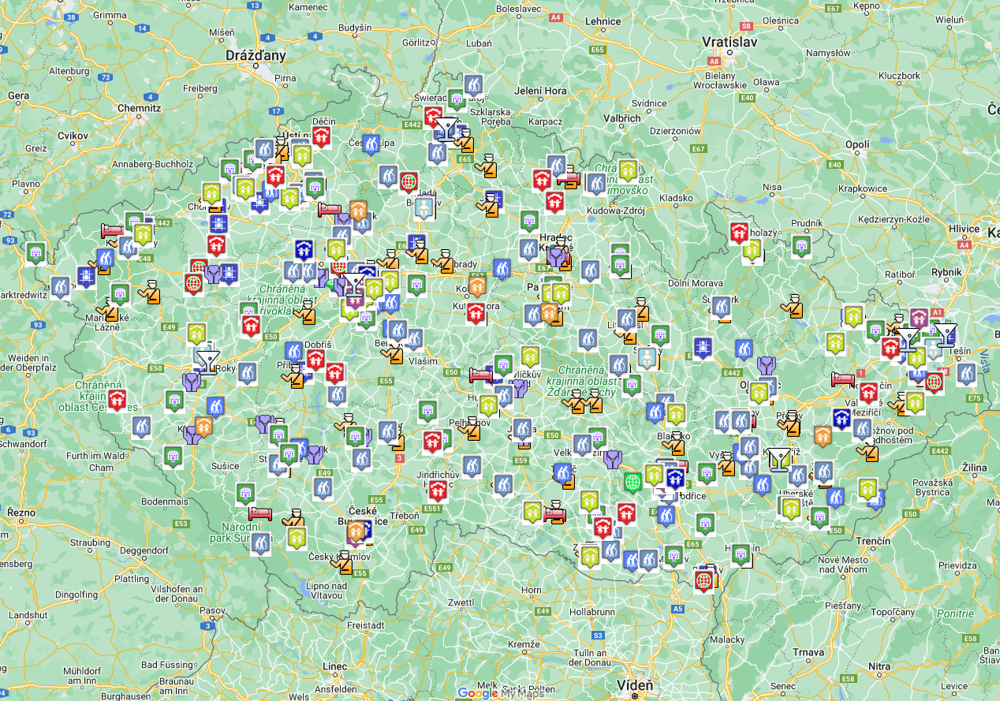

\
Ombudsman navštěvuje zařízení pro výkon ústavní a ochranné výchovy a další zařízení pro děti. Zprávy z jednotlivých návštěv zařízení jsou dostupné v [Evidenci stanovisek ochránce](https://eso.ochrance.cz/Vyhledavani/Search)(oblast práva 801 a násl.) či v mapě navštívených zařízení viz níže.

[Zpráva z návštěv školských zařízení pro výkon ústavní výchovy (2022)](https://www.ochrance.cz/uploads-import/ESO/%C5%A0kolsk%C3%A1-za%C5%99%C3%ADzen%C3%AD_CZ_el-verze.pdf)

[Zpráva z návštěv zařízení pro děti vyžadující okamžitou pomoc (2019) ](https://www.ochrance.cz/uploads-import/ESO/19-2015-_NZ_SZ_ZDVOP.pdf)

[Zpráva z návštěv středisek výchovné péče (2013)](https://www.ochrance.cz/uploads-import/ochrana_osob/2013/NZ-27_2012-strediska-vychovne-pece.pdf) 

[Zpráva z návštěv diagnostických ústavů (2013)](https://www.ochrance.cz/uploads-import/ESO/26-2012-NZ.pdf)

[Zpráva z návštěv tzv. kojeneckých ústavů (2012)](https://eso.ochrance.cz/Nalezene/Edit/2710)

[Zpráva z návštěv školských zařízení pro výkon ústavní a ochranné výchovy (2011) ](https://www.ochrance.cz/uploads-import/ESO/53-2010_Souhrnna_zprava-skolska_zarizeni_pro_vykon_ustavni_vychovy_a_ochranne_vychovy.pdf)

[Zpráva z návštěv školských zařízení pro výkon ústavní a ochranné výchovy (2007) ](https://www.ochrance.cz/uploads-import/ESO/Souhrnna_zprava_z_navstev_zarizeni__-_ochranna_a_ustavni_vychova_-_50-5006-NZ.pdf)\




Ombudsman navštěvuje pobytová zařízení sociálních služeb. Zprávy z jednotlivých návštěv zařízení jsou dostupné v [Evidenci stanovisek ochránce](https://eso.ochrance.cz/Vyhledavani/Search)(oblast práva 801 a násl.) či v mapě navštívených zařízení viz níže.

[Aktualita ohledně návštěv neregistrovaných zařízení (2024)](/media/navstevy_neregistrovanych_zarizeni_2024.pdf)

[Zpráva z návštěv domovů pro osoby se zdravotním postižením (2020)](https://www.ochrance.cz/uploads-import/ESO/11-2017-NZ-OV_souhrnna_zprava_DOZP.pdf) 

[Zpráva z návštěv ubytovacích zařízení poskytujících péči bez oprávnění (2015) ](https://www.ochrance.cz/uploads-import/ESO/28-2014-NZ_Souhrnna_zprava_-_neregistrovana_zarizeni__CJ_.pdf)

[Zpráva z návštěv domovů pro seniory a domovů se zvláštním režimem (2015)](https://www.ochrance.cz/uploads-import/ESO/7-2013-NZ-Zprava_z_navstev.pdf) 

[Zpráva z návštěv domovů pro osoby se zdravotním postižením (2009)](https://eso.ochrance.cz/Nalezene/Edit/2788) 





Ombudsman navštěvuje zařízení poskytující psychiatrickou péči. služeb. Zprávy z jednotlivých návštěv zařízení jsou dostupné v [Evidenci stanovisek ochránce](https://eso.ochrance.cz/Vyhledavani/Search) (oblast práva 801 a násl.) či v mapě navštívených zařízení viz níže.

[Zpráva z návštěv zařízení dětské psychiatrie (2022)](/media/zprava_z_navstev_zarizeni_detske_psychiatrie.pdf) 

[Zpráva věnující se ochrannému léčení, omezovacím prostředkům a dalším tématům (2019) ](https://www.ochrance.cz/uploads-import/ESO/21-2016-NZ-MLU_SZ-ochranne_leceni.pdf)

[Zpráva z návštěv dětských psychiatrických nemocnic (2013)](https://eso.ochrance.cz/Nalezene/Edit/2610) 

[Zpráva z následných návštěv psychiatrických léčeben (2010)](https://www.ochrance.cz/uploads-import/ESO/50-2010-NZ-zprava_z_naslednych_navstev.pdf) 

[Zpráva z návštěv psychiatrických léčeben (2008)](https://www.ochrance.cz/uploads-import/ESO/SZ_psychiatricke_lecebny_08.pdf) 





Ombudsman navštěvuje zařízení také další zdravotnická zařízení. Zprávy z jednotlivých návštěv zařízení jsou dostupné v [Evidenci stanovisek ochránce](https://eso.ochrance.cz/Vyhledavani/Search)(oblast práva 801 a násl.) či v mapě navštívených zařízení viz níže.

[Zpráva z návštěv léčeben pro dlouhodobě nemocné (2017)](https://www.ochrance.cz/uploads-import/ESO/LDN_souhrnna_zprava_2017_web.pdf) 

[Zpráva z návštěv protialkoholních záchytných stanic (2014)](https://eso.ochrance.cz/Nalezene/Edit/2332) 

[Zpráva z návštěv tzv. kojeneckých ústavů (2012)](https://eso.ochrance.cz/Nalezene/Edit/2710) 





Ombudsman navštěvuje zařízení vazební věznice, věznice a ústavy pro výkon zabezpečovací detence. Vyřizuje také individuální stížnosti z těchto zařízení. Zprávy z jednotlivých návštěv zařízení jsou dostupné v [Evidenci stanovisek ochránce](https://eso.ochrance.cz/Vyhledavani/Search) (oblast práva 801 a násl.) či v mapě navštívených zařízení viz níže.

[Zpráva z návštěv vazebních věznic (2022)](https://www.ochrance.cz/uploads-import/ESO/Brozura%20vazebni%20veznice%2010-22%20online.pdf)

[Zabezpečovací detence (2019)](https://www.ochrance.cz/uploads-import/ESO/5-2019-NZ-MKL_Souhrna_zprava_zabezpecovaci_detence.pdf) 

[Sborník stanovisek ochránce - Vězeňství II (2019)](https://www.ochrance.cz/uploads-import/Publikace/sborniky_stanoviska/Sbornik_Vezenstvi_II.pdf)

[Zpráva z návštěv věznic (2016)](https://www.ochrance.cz/uploads-import/ESO/14-2014-NZ-Souhrnna_zprava_z_navstev_veznic.pdf) 

**Další dokumenty z oblasti vězeňství**

[Komentář k revidovaným Evropským vězeňským pravidlům (2020)](/media/komentar_k_revidovanym_evropskym_vezenskym_pravidlum_2020_.pdf)

[OSN zásady účinného vyšetřování a dokumentování mučení a jiného krutého, nelidského či ponižujícího zacházení nebo trestání (2000)](/media/osn_zasady_ucinneho_vysetrovani_a_dokumentovani_muceni_a_jineho_kruteho_nelidskeho_ci_ponizujiciho_zachazeni_nebo_trestani_2000_.pdf)

[Revidovaná Evropská vězeňská pravidla (2020)](/media/revidovana_evropska_vezenska_pravidla_2020_.pdf)

[Standardní minimální pravidla OSN pro zacházení s vězněnými osobami (Pravidla Nelsona Mandely; 2015)](/media/standardni_minimalni_pravidla_osn_pro_zachazeni_s_veznenymi_osobami_pravidla_nelsona_mandely_2015_.pdf)





Ombudsman navštěvuje policejní cely. Zprávy z jednotlivých návštěv zařízení jsou dostupné v[ Evidenci stanovisek ochránce](https://eso.ochrance.cz/Vyhledavani/Search)(oblast práva 801 a násl.) či v mapě navštívených zařízení viz níže. 

[Zpráva z návštěv policejních cel (2017)](https://www.ochrance.cz/uploads-import/ESO/22-2017-NZ_Souhrnna_zprava_Policejni_cely_2017_CZ.pdf)





Ombudsman navštěvuje zařízení pro zajištění cizinců, přijímací a pobytová střediska. Zprávy z jednotlivých návštěv zařízení jsou dostupné v [Evidenci stanovisek ochránce](https://eso.ochrance.cz/Vyhledavani/Search)(oblast práva 801 a násl.) či v mapě navštívených zařízení viz níže.





Ochránce sleduje výkon správního i trestního vyhoštění, předání zajištěných cizinců nebo jejich průvozu přes Českou republiku. Zprávy z jednotlivých sledování vyhoštění jsou dostupné v [Evidenci stanovisek ochránce](https://eso.ochrance.cz/Vyhledavani/Search)(oblast práva 804.2 – doprovody cizinců).



### [Mapa navštívených zařízení](https://www.google.com/maps/d/embed?mid=1h8Nxe-xnknSxOMrZKUyud0jmjdpsLAyt&hl=cs&ll=49.860819393211585%2C15.441935000000022&z=8)

