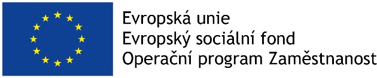

<!--StartFragment-->

<!--EndFragment-->

<!--StartFragment-->

Kancelář veřejného ochránce práv se dlouhodobě snaží vycházet vstříc potřebám svých zaměstnanců a pomáhat jim při slaďování pracovního a rodinného života. Umožňuje proto v souladu se zákoníkem práce například zkrácení pracovního úvazku nebo práci odjinud (mobile office). Zůstává s nimi v kontaktu po dobu mateřské a rodičovské dovolené a průběžně je informuje o vývoji v Kanceláři, podporuje jejich odborný růst a snaží se jim tak usnadnit pozdější návrat na pracoviště.

Od roku 2015 provozuje Kancelář také Dětskou skupinu Motejlci. Pomáhá tím rodičům vrátit se do zaměstnání z rodičovské dovolené dřív než ve třech letech dítěte, navíc bez zbytečného stresu a obav, jestli se pro dítě najde místo v mateřské školce v okolí bydliště.

Dětská skupina má kapacitu 12 dětí a je otevřená každý všední den od 7:30 do 16:30. V současné době využívá jejích služeb 11 rodičů a skupinu střídavě navštěvuje celkem 13 dětí ve věku od 1 roku do 4 let, v letních měsících využívá služeb dětské skupiny až 20 rodičů. O děti pečují kvalifikované osoby, které zajišťují rozmanitý program korespondující s plánem výchovy.

Od 1. dubna 2016 je provoz dětské skupiny spolufinancován Evropskou unií díky projektu „Dětská skupina Motejlci“ (reg.č. CZ.03.1.51/0.0/0.0/19_101/0016236).

<!--EndFragment-->

