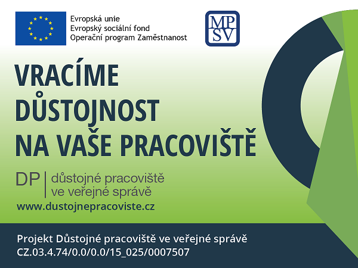

<!--StartFragment-->

Projekt Důstojné pracoviště slouží ke vzdělávání a rozvoji pracovníků veřejné správy v oblasti prevence a eliminace násilí na pracovišti. Připravili jsme pro vás inovativní koncept, jehož cílem je dosáhnout kvalitnější práce s lidskými zdroji, poskytnout metodické a evaluační postupy, jež zvýší krizovou připravenost, zlepší komunikaci a umožní vytvářet respekt a zdravé vztahy na pracovišti.

<https://www.dustojnepracoviste.cz/> 

<!--EndFragment-->

