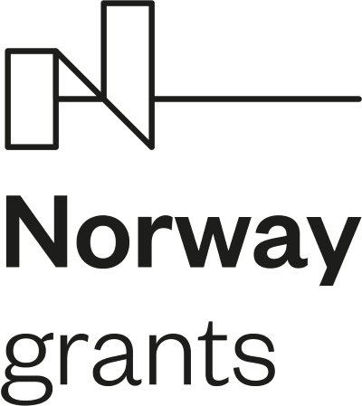
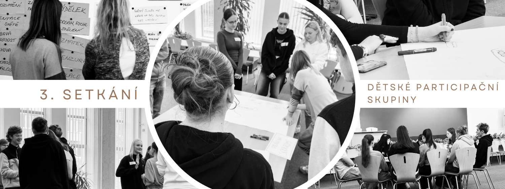
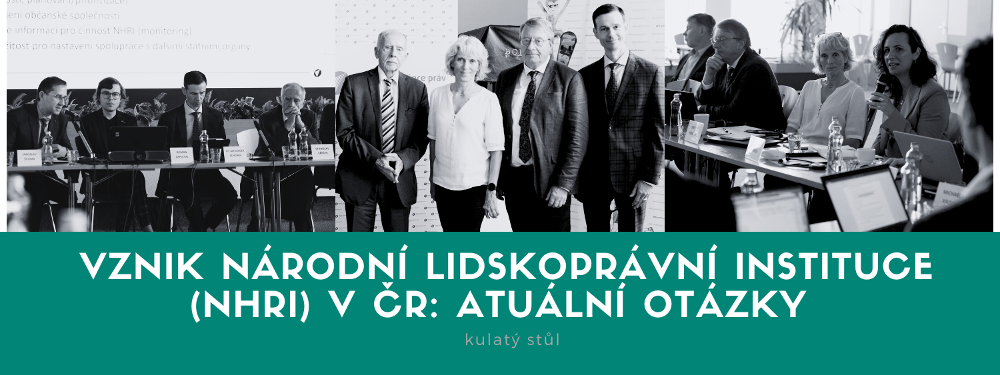
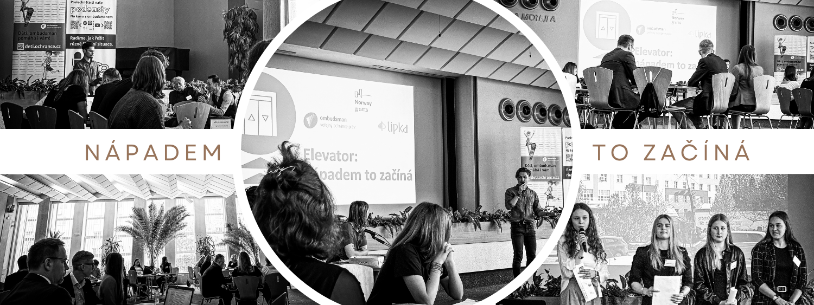
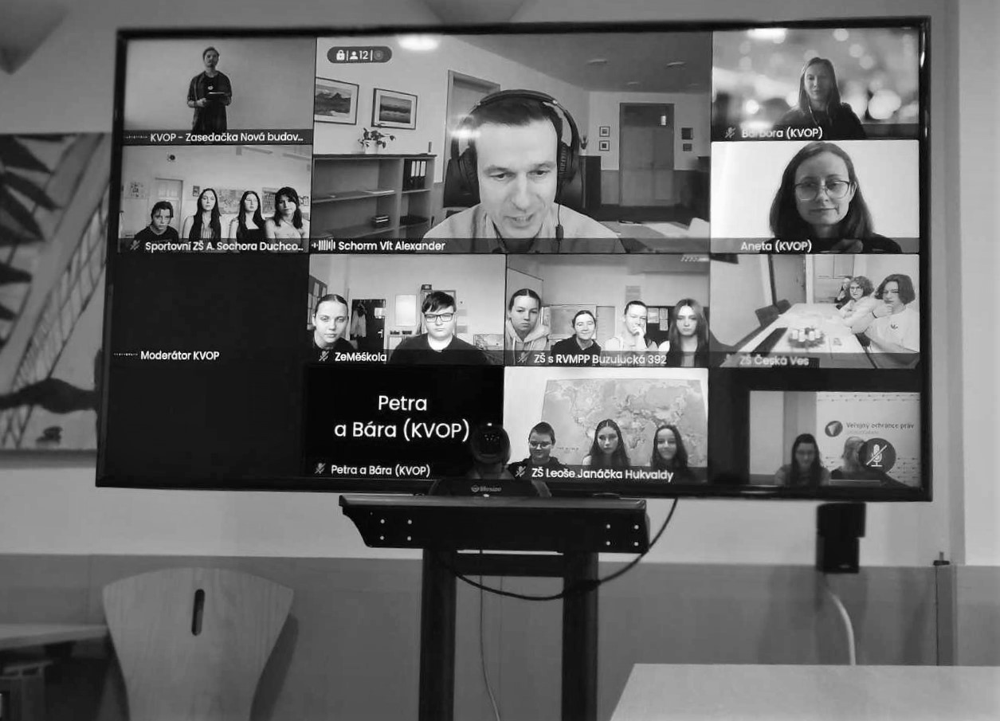
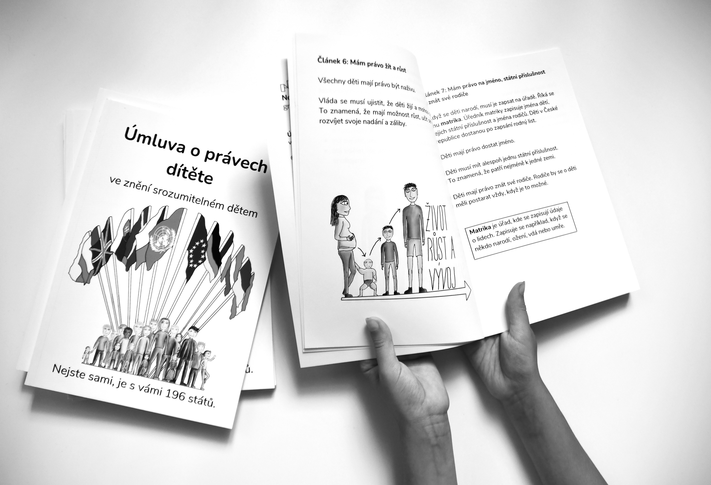
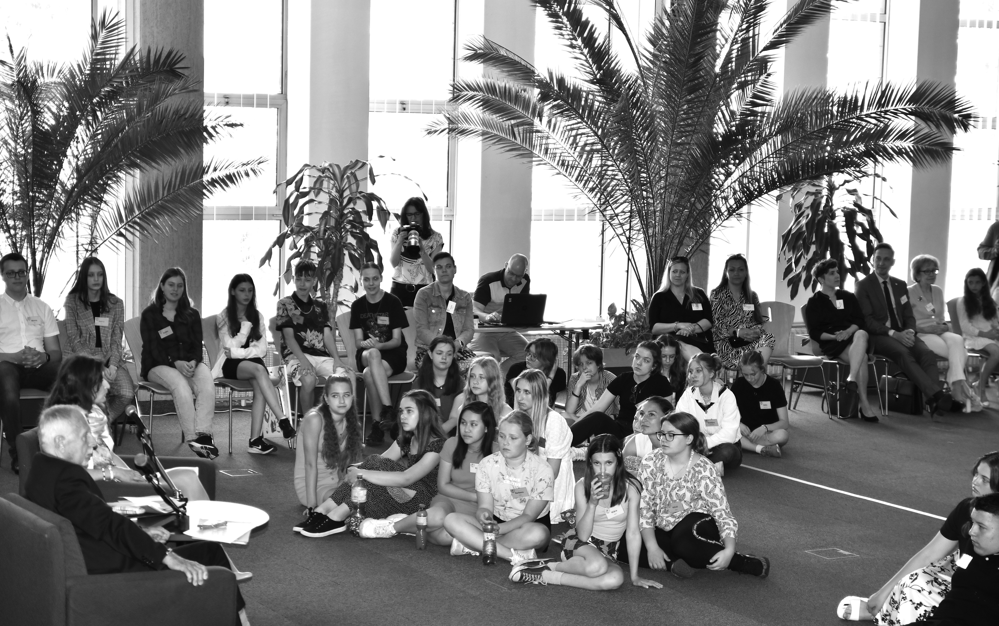
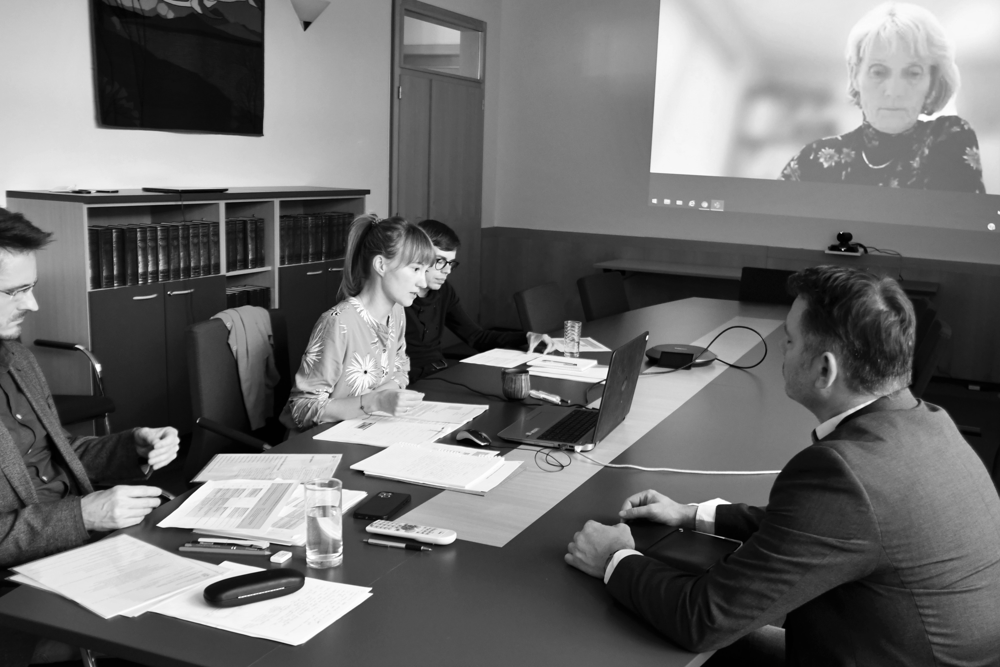
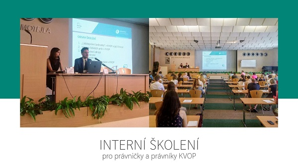

<h2>Partneři projektu</h2>

Kancelář vybuduje nové partnerství s Norwegian National Human Rights Institution, která působí jako norská národní lidskoprávní instituce (dále jen &bdquo;NHRI&ldquo;) a má zkušenosti s uplatňováním lidskoprávního přístupu ve své činnosti. Zaměstnanci Kanceláře navštíví tuto norskou instituci, aby získali know-how, příklady dobré praxe a inspirovali se v metodách práce.

<h2>Stručný popis projektu</h2>

Veřejný ochránce práv (dále jen &bdquo;ochránce&ldquo;) dle zákona č. 349/1999 Sb., o veřejném ochránci práv, ve znění pozdějších předpisů, od samého počátku chrání osoby před jednáním vybraných veřejných úřadů a institucí, čímž má dle výslovného zákonného požadavku přispívat k ochraně základních práv a svobod. Jeho referenčním rámcem má být nejen prostá zákonnost, nýbrž vedle principů dobré správy rovněž principy demokratického právního státu, mezi něž v moderních demokraciích neodmyslitelně patří ochrana základních práv a svobod. V následujících letech se navíc působnost ochránce rozrostla o výsostně lidskoprávní agendy jako je např. ochrana osob omezených na svobodě a agenda rovného zacházení a ochrany před diskriminací.

Současný stav je takový, že ochránce, resp. Kancelář veřejného ochránce práv (dále jen &bdquo;Kancelář&ldquo;), která plní úkoly spojené s odborným, organizačním a technickým zabezpečením činnosti ochránce, má k dispozici dostatečné zdroje na pokrytí výkonu svých základních úkolů. Nedostává se však dalších prostředků na širší okruh aktivit s plošným celospolečenským dopadem, které by přispívaly k systémovým změnám.

<h2>Cíl projektu</h2>

Projekt cílí na vyvážení zmiňovaného stavu tím, že personálně posiluje čtyři odbory Kanceláře:

<ul>
	<li>Posílení činnosti sekretariátu ochránce a jeho zástupce s cílem důsledně a systematicky uplatňovat mezinárodní a ústavní standardy ochrany lidských práv ve výstupech ochránce;</li>
	<li>Posílení prevence špatného zacházení (odbor dohledu nad omezováním osobní svobody);</li>
	<li>Posílení ochrany ohrožených dětí a jejich rodin a podpora práv dětí (odbor rodiny, zdravotnictví a práce) a</li>
	<li>Posílení práva na rovné zacházení a ochranu před diskriminací (odbor rovného zacházení).</li>
</ul>

<strong>Tento předem definovaný projekt pod registračním číslem LP-PDP3-001 je financován z Norských fondů 2014 &ndash; 2021</strong> (program Lidská práva) a umožní provádění analytické, výzkumné a osvětové činnosti, které napomohou zlepšení situace ohrožených a marginalizovaných skupin, a to jak z hlediska ochrany jejich práv, tak z hlediska získávání kompetencí při jejich prosazování.&nbsp;

<ul>
	<li><a href="http://www.norskefondy.cz">www.norskefondy.cz</a>&nbsp;&nbsp;</li>
	<li><a href="http://www.eeagrants.org">www.eeagrants.org</a></li>
</ul>

<h2>Aktuality</h2>

27.2.2024 &ndash; uspořádali jsme závěrečnou tiskovou konferenci k&nbsp;projektu. Více se dozvíte <a href="https://www.ochrance.cz/aktualne/jak_posilit_ochranu_lidskych_prav_v_ceske_republice_ombudsman_cerpal_ze_zkusenosti_z_norska/">zde</a>.

17.1.2024 &ndash; zveřejňujeme <a href="https://www.ochrance.cz/uploads-import/ESO/DIS%2072-2023-DST%20Jak%20se%20vyhnout%20diskriminaci%20na%20pracovi%C5%A1ti-final.pdf">Doporučení pro zaměstnavatele &ndash; Jak se vyhnout diskriminaci na pracovišti</a>, dále související praktickou příručku <a href="https://www.ochrance.cz/uploads-import/ESO/68-21-DIS-HB-1-final.pdf">Nejčasnější případy diskriminace a jak se jim vyhnout</a> a přinášíme rovněž poznatky z&nbsp;naplňování práva na rovné zacházení a ochrany před diskriminací za rok 2023 v&nbsp;monitorovací zprávě <a href="https://www.ochrance.cz/uploads-import/ESO/Monitorovac%C3%AD%20zpr%C3%A1va%2055-2023-final.pdf">Naplňování práva na rovné zacházení a ochrany před diskriminací</a>. &nbsp;

<h2>Co jsme realizovali v roce 2023 v rámci projektu</h2>

<ul>
	<li>19.12.2023 &ndash; jak vypadá Mezinárodní úmluva o právech lidí s&nbsp;postižením ve formátu pro snadné čtení se můžete podívat <a href="umluva_crpd-logo.pdf">zde</a>.</li>
	<li>15.12.2023 &ndash; v&nbsp;návaznosti na partnerství Kanceláře s&nbsp;norskou národní lidskoprávní institucí - Norges institusjon for menneskerettigheter, přinášíme aktuální pohled na vznik národní lidskoprávní instituce v&nbsp;České republice. Článek si můžete přečíst <a href="vznik_nhri_v_cr_clanek.docx">zde</a>.</li>
	<li>14.12.2023 &ndash; zveřejňujeme dvacátou zprávu z&nbsp;následné návštěvy zařízení z&nbsp;Dětského domova Radkov &ndash; Dubová <a href="https://www.ochrance.cz/uploads-import/ESO/33_2022_NZ%20DD%20Radkov%20Final.pdf">zde</a>.</li>
	<li>30.11.2023 &ndash; jsme zrealizovali workshop Můj život, moje volba, aneb sebeurčení, kde jsme představili předběžné výsledky výzkumu týkajícího se tématu deinstitucionalizace, který mapuje přístup krajů a Ministerstva práce a sociálních věcí v&nbsp;kontextu naplňování práv lidí s&nbsp;postižením. Zde můžete zhlédnout <a href="11_30_muj_zivot_moje_volba_aneb_sebeurceni_prezentace.pdf">prezentaci k&nbsp;workshopu</a>.</li>
	<li>29.11.2023 &ndash; jsme uspořádali workshop Přístupnost a bezbariérové užívání staveb, kde jsme se zaměřili na výsledky výzkumu týkající se postupů stavebních úřadů a krajských úřadů v&nbsp;této oblasti. Zde můžete zhlédnout<a href="11_29_pristupnost_a_bezbarierove_uzivani_staveb_prezentace.pdf"> prezentaci k&nbsp;workshopu</a>.</li>
</ul>

<ul>
	<li>24.11.2023 &ndash; zveřejňujeme osmnáctou zprávu z&nbsp;následné návštěvy policejní cely Obvodního oddělení Mělník&nbsp;<a href="https://www.ochrance.cz/uploads-import/ESO/OOP%20M%C4%9Bln%C3%ADk%2017-2023-NZ.pdf">zde</a>&nbsp;a devatenáctou zprávu z&nbsp;následné návštěvy Domova pro seniory Uničov, s.r.o. <a href="https://www.ochrance.cz/uploads-import/ESO/NZ%202-2023%20Uni%C4%8Dov%20zpr%C3%A1va.pdf">zde</a>.</li>
	<li>
	
22.11.2023 &ndash; zveřejňujeme šestnáctou zprávu z&nbsp;následné návštěvy Výchovného ústavu Žulová <a href="https://www.ochrance.cz/uploads-import/ESO/13_2023_NZ%20V%C3%9A%20%C5%BDulov%C3%A1.pdf">zde</a> a sedmnáctou zprávu z&nbsp;následné návštěvy policejní cely obvodního oddělení Litoměřice <a href="https://www.ochrance.cz/uploads-import/ESO/Zpr%C3%A1va%20NZ%2016-2023%20Litom%C4%9B%C5%99ice.pdf">zde</a>.

	</li>
	<li>
	
22.11.2023 &ndash; jsme zrealizovali workshop Dobrá praxe při zajišťování bydlení pro zranitelné skupiny s&nbsp;cílem představit hlavní výsledky našeho výzkumu a diskutovat nad příklady dobré praxe, ale i nad překážkami, na které pomáhající organizace naráží. Zde můžete zhlédnout <a href="11_22_dobra_praxe_v_zajistovani_bydleni_pro_zranitelne_skupiny_prezentace.pdf">prezentaci k&nbsp;workshopu</a>. &nbsp;

	</li>
</ul>

<ul>
	<li>
	
20.11.2023 &ndash; uskutečnili jsme druhý běh třetí dětské participační skupiny, jak vše probíhalo můžete zjistit <a href="https://deti.ochrance.cz/aktualne/je_tezke_pomerovat_mezi_jednotlivymi_pravy/">zde</a>.

	</li>
	<li>13.11.2023 &ndash; dnes jsme uspořádali 3. setkání dětské participační skupiny. Jak probíhalo, se můžete dozvědět <a href="https://deti.ochrance.cz/aktualne/muze_se_stretavat_pravo_na_soukromi_s_pravem_na_sdileni_informaci/">zde</a>.</li>
</ul>

<ul>
	<li>13.11.2023 &ndash; zveřejňujeme Zprávu o šetření z&nbsp;vlastní iniciativy a doporučení ve věci ve věci kontaktů dětí a rodičů ve výkonu trestu odnětí svobody (VTOS) zaměřenou na činnost orgánů sociálně-právní ochrany dětí (OSPOD) <a href="https://www.ochrance.cz/uploads-import/ESO/VI%204353-22-TK%20Z18%20final.pdf">zde</a>. V posledních letech si totiž rodiče ve VTOS stále častěji stěžovali na to, že jim není umožněn osobní ani nepřímý styk s jejich dětmi. Prošetření několika individuálních stížností na postup OSPOD odhalilo mnohdy závažná pochybení, jakož i nejednotnou praxi OSPOD podpořenou absencí metodické podpory. Šetření bylo zaměřeno na děti, které mají alespoň jednoho rodiče ve VTOS a které OSPOD vede v evidenci ohrožených dětí, vykonává preventivní a poradenskou činnost nebo kolizní opatrovnictví. Sledovali jsme období od 1. ledna 2019 do 31. března 2022.</li>
	<li>Šetření proběhlo formou elektronického dotazníku, kterého se zúčastnily všechny obecní úřady obcí s rozšířenou působností. Výsledky dotazníkového šetření jsou součástí sociologického výzkumu, který je přílohou zprávy o šetření <a href="https://www.ochrance.cz/uploads-import/ESO/VI%204353-22_sociologick%C3%BD%20v%C3%BDzkum.pdf">zde</a>.</li>
	<li>Současně zveřejňujeme Zprávu o šetření z&nbsp;vlastní iniciativy a doporučení Vězeňské službě České republiky (VS) ve věci kontaktů dětí s&nbsp;uvězněnými rodiči <a href="https://www.ochrance.cz/uploads-import/ESO/VI%20988-23-Z18%20final.pdf">zde</a>. V této zprávě shrnujeme výsledky šetření postupu VS při zajišťování kontaktů dětí s&nbsp;uvězněnými rodiči. Bez její součinnosti totiž není možné kontakty uvězněného rodiče s dětmi zajišťovat. Závěry a&nbsp;doporučení z&nbsp;této zprávy lze zobecnit a&nbsp;přiměřeně použít pro&nbsp;všechny skupiny uvězněných rodičů &ndash; obviněných ve&nbsp;vazbě, odsouzených ve&nbsp;výkonu trestu i&nbsp;chovanců ve&nbsp;výkonu zabezpečovací detence.</li>
	<li>
	
18.9.2023 &ndash; Uspořádali jsme kulatý stůl za účasti norského partnera. Více se můžete dočíst <a href="https://www.ochrance.cz/aktualne/v_kancelari_ombudsmana_budou_o_moznem_vzniku_ceske_narodni_lidskopravni_instituce_nhri_v_pondeli_diskutovat_odbornici_na_ochranu_lidskych_prav_ze_sedmi_evropskych_statu/">zde</a>.

	</li>
</ul>

<ul>
	<li>
	
14.9.2023 &ndash; jsme zrealizovali kulatý stůl na téma kontakty dětí a rodičů ve výkonu trestu odnětí svobody a s&nbsp;nimi související praxe orgánů sociálně-právní ochrany dětí.

	</li>
	<li>4.9.2023 &ndash; přinášíme poznatky z&nbsp;naplňování práva na rovné zacházení a ochrany před diskriminací za rok 2022. Tiskovou zprávu s&nbsp;dalšími podrobnostmi naleznete <a href="https://www.ochrance.cz/aktualne/podle_pravidel_pro_zaky_s_lehkym_mentalnim_postizenim_se_porad_uci_vice_romskych_deti_nez_by_odpovidalo_zastoupeni_romu_mezi_vsemi_skolaky/">zde</a>, monitorovací zprávu za rok 2022 <a href="https://www.ochrance.cz/uploads-import/ESO/monitorovaci-zprava_2023-WEB-CZ_10-23.pdf">zde</a>&nbsp;a v anglickém jazyce <a href="https://www.ochrance.cz/uploads-import/ESO/monitorovaci-zprava_2023-WEB-EN%2010-23.pdf">zde</a>.</li>
	<li>
	
14.8.2023 &ndash; zveřejňujeme čtrnáctou zprávu z&nbsp;následné návštěvy zařízení a to Zařízení pro zajištění cizinců Balková <a href="https://www.ochrance.cz/uploads-import/ESO/NZ%2043-2022-T%C5%BDK%20-%20zpr%C3%A1va%20final.pdf">zde</a> a patnáctou zprávu z&nbsp;následné návštěvy zařízení Policejní cely Plzeň <a href="https://www.ochrance.cz/uploads-import/ESO/PEO%20Plze%C5%88%203-2023-NZ.pdf">zde</a>.

	</li>
	<li>
	
18.7.2023 &ndash; zveřejňujeme jedenáctou zprávu z&nbsp;následné návštěvy zařízení Policejní cely Zlín <a href="https://www.ochrance.cz/uploads-import/ESO/OOP%20Zl%C3%ADn%2036-2022%20nz.pdf">zde</a>, dvanáctou zprávu z&nbsp;následné návštěvy zařízení Výchovný ústav Višňové <a href="https://www.ochrance.cz/uploads-import/ESO/V%C3%9A%20Vi%C5%A1%C5%88ov%C3%A9_Zpr%C3%A1va%20z%20n%C3%A1v%C5%A1t%C4%9Bvy_VAS.pdf">zde</a> a třináctou zprávu z&nbsp;následné návštěvy zařízení Policejní cely Jihlava <a href="https://www.ochrance.cz/uploads-import/ESO/Zpr%C3%A1va%20NZ-4-2023%20final.pdf">zde</a>. &nbsp;

	</li>
	<li>
	
23.6.2023 &ndash; jaké jsou výsledky rozsáhlého výzkumu veřejného ochránce práv na téma těhotenství a mateřství na pracovišti se můžete dočíst v&nbsp;<a href="https://www.ochrance.cz/aktualne/zeny_v_cesku_se_kvuli_tehotenstvi_a_materstvi_setkavaji_v_praci_s_mnohymi_barierami_potvrdil_vyzkum_verejneho_ochrance_prav/">tiskové zprávě</a>. Zveřejňujeme i samotnou <a href="vyzkumna_zprava_tehotenstvi_a_materstvi_na_pracovisti.pdf">výzkumnou zprávu</a>.

	</li>
	<li>
	
22.6.2023 &ndash; jsme zrealizovali workshop Rodičovství na pracovišti pro širokou veřejnost. Cílem workshopu bylo přiblížit zjištění z&nbsp;výzkumu Těhotenství a mateřství na pracovišti. Zde můžete zhlédnout <a href="06_22_rodicovstvi_na_pracovisti_prezentace_1_.pdf">prezentaci k&nbsp;výzkumné zprávě</a>, <a href="06_22_rodicovstvi_na_pracovisti_prezentace_2_.pdf">prezentaci k&nbsp;doporučení</a>, <a href="06_22_rodicovstvi_na_pracovisti_prezentace_3_.pdf">prezentaci k&nbsp;praktické příručce</a> a <a href="06_22_rodicovstvi_na_pracovisti_prezentace_4_.pdf">prezentaci ke kazuistikám</a>.

	</li>
	<li>
	
K 15.6.2023, tj. za 9. monitorovací období, zveřejňujeme odborné výstupy sekretariátu ochránce a jeho zástupce. Jedná se o&nbsp;<a href="szd_2-2023_osoby_bez_statni_prislusnosti_.pdf">vyrozumění veřejného ochránce práv vládě ČR o nedosažení nápravy zjištěných pochybení úřadu ve věci právního postavení osob bez státní příslušnosti</a>, o <a href="szd_7-2023_neakceptace_plnych_moci_.pdf">vyrozumění veřejného ochránce práv vládě ČR o nedosažení nápravy zjištěných pochybení úřadu ve věci neakceptace plných mocí v řízení o poskytnutí mezinárodní ochrany</a> a o <a href="szd_6-2023_cinsti_krestane_.pdf">vyrozumění veřejného ochránce práv vládě ČR o nedosažení nápravy zjištěných pochybení úřadu ve věci průtahů v řízeních o udělení mezinárodní ochrany skupině tzv. čínských křesťanů</a>.

	</li>
	<li>
	
7.6.2023 &ndash; zveřejňujeme desátou zprávu z&nbsp;následné návštěvy zařízení a to z&nbsp;Psychiatrické nemocnice Kosmonosy. Zpráva je dostupná <a href="https://www.ochrance.cz/uploads-import/ESO/NZ%2032-2022%20NF.pdf">zde</a>.

	</li>
	<li>
	
6.6.2023 - zveřejňujeme&nbsp;<a href="https://www.ochrance.cz/uploads-import/ESO/16-2023-DIS-DJ-JKV_1-final.pdf">třetí projektovou monitorovací zprávu&nbsp;</a>z&nbsp;oblasti naplňování práva ochrany před diskriminací a to za rok 2022.

	</li>
	<li>
	
19.5.2023 &ndash; Uspořádali jsme druhé setkání dětské participační skupiny. Do Brna zavítaly školní kolektivy - autoři sedmi nejlepších středoškolských projektů přihlášených do&nbsp;naší soutěže&nbsp;<a href="https://deti.ochrance.cz/kdo/elevator_napadem_to_zacina/">Elevator: nápadem to&nbsp;začíná</a>. O tom, jak chtějí středoškoláci měnit svět kolem sebe, se dočtete více <a href="https://deti.ochrance.cz/aktualne/stredoskolaci_chteji_menit_svet_kolem_sebe_dnes_nam_predstavili_sve_napady/">zde</a>.

	</li>
</ul>

<ul>
	<li>26.4.2023 &ndash; Zveřejňujeme další moduly e-learningového kurzu o antidiskriminačním právu. Více informací se dozvíte v&nbsp;tiskové zprávě <a href="https://www.ochrance.cz/aktualne/diskriminace_v_bydleni_vzdelavani_nebo_praci-_vyzkousejte_dalsi_casti_e-learningu_ombudsmana/">zde</a>.</li>
	<li>
	
7.3.2023 &ndash; o našem novém e-learningovém kurzu informují média například <a href="https://radiozurnal.rozhlas.cz/line-kurz-od-ombudsmana-nauci-jak-poznat-a-resit-diskriminaci-8945565">zde</a>.

	</li>
	<li>
	
1.3.2023 - u&nbsp;příležitosti&nbsp;Zero Discrimination Day, který připadá právě na&nbsp;1. března, spouštíme první modul on-line kurzu, který je zaměřený na antidiskriminační právo. Více se dočtete v&nbsp;tiskové zprávě <a href="https://www.ochrance.cz/aktualne/jak_poznat_a_resit_diskriminaci_naucte_se_to_v_novem_e-learningu_ombudsmana/">zde</a> a do kurzu se podíváte <a href="https://diskriminace.netventic.net/login">zde</a>.

	</li>
	<li>
	
6.2.2023 &ndash; zveřejňujeme devátou zprávu z&nbsp;následné návštěvy zařízení a to z&nbsp;Psychiatrické kliniky FN v&nbsp;Plzni. Zpráva je dostupná <a href="https://www.ochrance.cz/uploads-import/ESO/NZ%2025-2022%20final.pdf">zde</a>.

	</li>
	<li>
	
20.1.2023 &ndash; zveřejňujeme osmou zprávu z&nbsp;následné návštěvy zařízení a to z&nbsp;Domova pro osoby se zdravotním postižením Osek. Zpráva je dostupná <a href="https://www.ochrance.cz/uploads-import/ESO/NZ%2036-2021-BM%20zpr%C3%A1va.pdf">zde</a>.

	</li>
</ul>

<h2>Co jsme realizovali v roce 2022 v rámci projektu</h2>

<ul>
	<li>
	
19.12.2022 - zveřejňujeme sedmou zprávu z&nbsp;následné návštěvy zařízení a to z&nbsp;Policejní cely obvodního oddělení Třebíč. Zpráva je dostupná <a href="https://www.ochrance.cz/uploads-import/ESO/OOP%20T%C5%99eb%C3%AD%C4%8D%20NZ%2018-2022-PG%20zpr%C3%A1va.pdf">zde</a>.

	</li>
	<li>
	
K 15.12.2022, tj. za 8. monitorovací období, zveřejňujeme odborné výstupy sekretariátu ochránce a jeho zástupce. Jedná se o sankční materiál na vládu (<a href="ii-material_szd-24-2022-cb_mlade_buky.pdf">neregistrované zařízení sociálních služeb Mladé Buky</a>), vyjádření vedlejšího účastníka v&nbsp;řízení před ESLP (<a href="szd_9-22_vyjadreni_k_eslp_eng.pdf">neregistrované zařízení sociálních služeb Mladé Buky</a>) a dva materiály týkající se legislativních připomínek ochránce a to <a href="63068_22_priloha_pripominky_zakon_o_vykonu_tos.pdf">novelizace zákona o výkonu trestu odnětí svobody</a> a dále tzv. <a href="55974-2022_lex_ukrajina_iv.pdf">Lex Ukrajina IV</a>.

	</li>
	<li>
	
8.12.2022 &ndash; Uskutečnili jsme první dětskou participační skupinu, která probíhala on-line. Děti ze dvanácti školních kolektivů měly možnost představit a prodiskutovat své projekty. Více o této aktivitě se dozvíte <a href="https://deti.ochrance.cz/aktualne/zkusme_to_zmenit/">zde</a>.

	</li>
</ul>

<ul>
	<li>19.10.2022 &ndash; ombudsman se dlouhodobě věnuje srozumitelnosti písemností, aby lidé rozuměli tomu, co jim píše. Zkoumáme, proč jsou některé úřední texty srozumitelné veřejnosti a jiné ne, v čem bývají největší potíže a zda je můžeme napravit. Proto jsme dne 14.10.2022 uspořádali kulatý stůl, kde jsme s&nbsp;odborníky mohli diskutovat na toto téma. Tiskovou zprávu k&nbsp;aktivitě naleznete <a href="https://www.ochrance.cz/aktualne/urednici_i_soudci_se_na_kulatem_stole_u_ombudsmana_shodli_ze_uredni_pisemnosti_maji_byt_srozumitelne_pro_ctenare/">zde</a>.</li>
	<li>19.10.2022 &ndash; zveřejňujeme šestou zprávu z&nbsp;Následné návštěvy zařízení a to z&nbsp;Dětské psychiatrické nemocnice Louny. Zpráva je dostupná <a href="https://www.ochrance.cz/uploads-import/ESO/NZ%2026-2021_DPN%20Louny.pdf">zde</a>.</li>
	<li>12.10.2022 &ndash; zveřejňujeme Doporučení ve věci vyhledávání obecných pěstounů a osvojitelů pro děti v&nbsp;pěstounské péči na přechodnou dobu za rok 2021 <a href="https://www.ochrance.cz/uploads-import/ESO/6324-2021-VOP-zpr%C3%A1va%20a%20doporu%C4%8Den%C3%AD.pdf">zde</a>. Opakovaně se při řešení individuálních stížností setkáváme s nejednotným přístupem krajských úřadů České republiky při vyhledávání obecných pěstounů a osvojitelů pro děti, které jsou v pěstounské péči na přechodnou dobu. Rozhodli jsme se proto zahájit šetření z vlastní iniciativy a prostřednictvím výzkumu postup krajských úřadů i obecních úřadů obcí s rozšířenou působností blíže prozkoumat. Výzkumná zpráva&nbsp;Analýza spisů dětí v pěstounské péči na přechodnou dobu je k dispozici <a href="https://www.ochrance.cz/uploads-import/ESO/v%C3%BDzkumn%C3%A1%20zpr%C3%A1va%206324-2021_new.pdf">zde</a>.</li>
	<li>27. 9. 2022 &ndash; zveřejňujeme tiskovou zprávu o stavu projektu, který se překlopil do své druhé poloviny. Co vše jsme zrealizovali se můžete dočíst v&nbsp;uceleném přehledu <a href="https://www.ochrance.cz/aktualne/projekt_posileni_aktivit_verejneho_ochrance_prav_v_ochrane_lidskych_prav_je_v_polovine/">zde</a>.</li>
	<li>16.9.2022 &ndash; zveřejňujeme poslední 7. díl videa s&nbsp;vlogerkou Aničkou, ve kterém si Anička povídá s&nbsp;ombudsmanem. Video je ke zhlédnutí&nbsp;<a href="https://deti.ochrance.cz/aktualne/jak_to_vypada_u_ombudsmana_v_kancelari_zjistila_to_anicka-/">zde</a>.</li>
	<li>9.9.2022 &ndash; zveřejňujeme 6. díl videa s&nbsp;vlogerkou Aničkou o tom, jak pomáhá ombudsman dětem, které žijí v&nbsp;dětských domovech, nebo výchovných ústavech. Video je ke zhlédnutí&nbsp;<a href="https://www.youtube.com/watch?v=BfMYDjRmHJE&amp;t=1s">zde</a>.</li>
	<li>
	
2.9.2022 - zveřejňujeme 5. díl videa s&nbsp;vlogerkou Aničkou na téma práva lidí s postižením. Video je ke zhlédnutí&nbsp;<a href="https://www.youtube.com/watch?v=JjmnpspcfJM&amp;list=PLWNv_IxgJdEJRcfAUHCC1fZ6J1NiW4qh2&amp;index=5">zde</a>.

	</li>
	<li>1.9.2022 &ndash; zpracovali jsme Úmluvu o právech dítěte do podoby vhodné pro dětského čtenáře. Více informace ke zhlédnutí <a href="https://deti.ochrance.cz/aktualne/chces_konecne_porozumet_umluve_o_pravech_ditete/">zde</a>.</li>
</ul>

<ul>
	<li>22.8.2022 &ndash; zveřejňujeme pátou Zprávu z&nbsp;následné návštěvy zařízení a to z&nbsp;Přijímacího střediska a zařízení pro zajištění cizinců Bělá &ndash; Jezová. Zpráva je dostupná <a href="https://www.ochrance.cz/uploads-import/ESO/10-2020-NZ-zpr%C3%A1va%20z%20opak%20n%C3%A1v%C5%A1t%C4%9Bvy.pdf">zde</a>.</li>
	<li>3.8.2022 &ndash; zveřejňujeme čtvrtou Zprávu z&nbsp;následné návštěvy zařízení a to z&nbsp;Výchovného ústavu Kostomlaty pod Milešovkou. Zpráva je dostupná <a href="https://www.ochrance.cz/uploads-import/ESO/48-2017-NZ_zpr%C3%A1va%20z%20n%C3%A1sledn%C3%A9%20n%C3%A1v%C5%A1t%C4%9Bvy_anon%20vn%C4%9Bj%C5%A1%C3%AD%20(1).pdf">zde</a>.</li>
	<li>16.7.2022 &ndash; zveřejňujeme druhou Zprávu z&nbsp;následné návštěvy zařízení a to z&nbsp;Vazební věznice Liberec. Zpráva je dostupná <a href="https://www.ochrance.cz/uploads-import/ESO/NZ%204-2022-JM.pdf">zde</a> a třetí Zprávu z&nbsp;následné návštěvy zařízení a to z&nbsp;Dětského domova se školou Býchory. Zpráva je dostupná <a href="https://www.ochrance.cz/uploads-import/ESO/23_2022_DD%C5%A0%20B%C3%BDchory%20zpr%C3%A1va.pdf">zde</a>.</li>
	<li>30.6.2022 &ndash; zveřejňujeme 4. díl videa s&nbsp;vlogerkou Aničkou na téma školství. Video je ke zhlédnutí <a href="https://www.youtube.com/watch?v=OcKbyR5Nzp0">zde</a>.</li>
	<li>30.6.2022 &ndash; zveřejňujeme tiskovou zprávu, která shrnuje témata, která vyvstala na dětské konferenci. Tisková zpráva je ke zhlédnutí <a href="https://www.ochrance.cz/aktualne/deti_by_chtely_aby_je_dospeli_brali_vazne-_temata_z_prvni_detske_ombudsmanske_konference_budou_moct_podrobneji_probrat_na_navazujicich_workshopech/tiskova_zprava_-_zhodnoceni_detske_konference.pdf">zde</a>. &nbsp;</li>
	<li>22.6.2022 &ndash; zveřejňujeme 3. díl ze série o ombudsmanovi pro děti Anička vloguje. Tentokrát je tématem diskriminace. Video je ke zhlédnutí <a href="https://www.youtube.com/watch?v=GiTQycQaZgM">zde</a>.</li>
	<li>21.6.2022 &ndash;&nbsp; jak to vypadlo na dětské konferenci můžete zhlédnout <a href="https://deti.ochrance.cz/aktualne/jak_to_vypadalo_na_nasi_konferenci/">zde</a>.</li>
	<li>16.6.2022 &ndash; zveřejňujeme 2. díl ze série Anička vloguje, na téma Úřady. Video je ke zhlédnutí <a href="https://www.youtube.com/watch?v=8wPzjwGk72M&amp;t=3s">zde</a>.</li>
	<li>15.6.2022 &ndash; zveřejňujeme <a href="monitorovaci_zprava_za_rok_2021.pdf">druhou projektovou monitorovací zprávu</a> z&nbsp;oblasti naplňování práva ochrany před diskriminací a to za rok 2021.</li>
	<li>15. 6. 2022 &ndash; v&nbsp;rámci osvěty zaměřené na děti jsme uspořádali historicky první konferenci určenou dětem. Účast na konferenci vyhrály školní kolektivy v kreativní soutěži na téma &bdquo;Jak ombudsman pomáhá dětem&ldquo;. Do ní se přihlásily čtyři stovky žáků z 33 základních škol a víceletých gymnázií z celé České republiky. Mezi osmdesáti soutěžními příspěvky byly písničky, povídky, plakáty, obrázky, básničky, prezentace nebo videa a komiksy. Mladí účastníci řešili témata jako participace dětí na veřejném životě nebo to, kde hledají pomoc při řešení různých problémů, a co by podle nich měl dělat dětský ombudsman.</li>
</ul>

<ul>
	<li>Další informace ke konferenci naleznete na dětském webu <a href="https://deti.ochrance.cz/aktualne/nase_konference_pro_deti_je_v_plnem_proudu/">zde</a>, nebo v&nbsp;tiskové zprávě <a href="https://www.ochrance.cz/aktualne/deti_na_ombudsmanske_konferenci_zjistovaly_jak_jim_muze_pomahat_verejny_ochrance_prav-_politici_a_odbornici_mezitim_diskutovali_o_detskem_ombudsmanovi/tz_detska_konference.pdf">zde</a>, která shrnuje veškeré projektové aktivity na poli osvěty zaměřené na děti. A ve video formátu s&nbsp;titulky a ve znakovém jazyce tiskovou zprávu zhlédnete <a href="https://www.youtube.com/watch?v=7joyhC2pDgQ">zde</a>.</li>
	<li>15.6.2022 &ndash; záznam z&nbsp;tiskové konference, kde jsme představili dosud zrealizované projektové aktivity v&nbsp;rámci osvěty zaměřené na děti naleznete <a href="https://www.youtube.com/watch?v=frRrDw4p7uc">zde</a>.</li>
	<li>K 15.6.2022, tj. za 7. monitorovací období, zveřejňujeme odborné výstupy sekretariátu ochránce a jeho zástupkyně. Jedná se o legislativní připomínky (<a href="6447_22_priloha_pripominka_k_navrhu_vyhlasky_c_505-2006.pdf">připomínky VOP k&nbsp;návrhu vyhlášky, kterou se mění vyhláška MPSV č. 505/2006 Sb</a>., kterou se provádějí některá ustanovení zákona o sociálních službách, ve znění pozdějších předpisů). Dále jde o vyjádření vedlejšího účastníka v&nbsp;řízení před Ústavním soudem (<a href="szd_13-2022_vrbetice_.pdf">návrh na zrušení vybraných ustanovení zákona č. 324/2021 Sb., o jednorázovém odškodnění subjektů dotčených mimořádnou událostí v areálu muničních skladů Vlachovice - Vrbětice a o změně některých zákonů</a>) a o vyjádření vedlejšího účastníka v&nbsp;řízení před Ústavním soudem (<a href="szd_16-22-vop-vyjadreni_pro_us.pdf">návrh na zrušení &sect; 454 odst. 1 zákona č. 292/2013 Sb., o zvláštních řízeních soudních, ve znění pozdějších předpisů</a>).</li>
	<li>
	
20.4.2022 jsme zrealizovali workshop pro zástupce ministerstev a dalších úřadů, některých krajů a neziskových organizací pracujících s&nbsp;cizinci &ndash; občany EU. Cílem workshopu bylo jednak představit výsledky rozsáhlého výzkumu Občané EU v&nbsp;ČR, který zjišťoval, jak se žije občanům EU v&nbsp;ČR a s&nbsp;jakými problémy se potýkají, &nbsp;a také diskutovat nad doporučeními ochránce, která na podkladě tohoto výzkumu vznikla. Zde můžete zhlédnout <a href="obcane-eu-v-cesku_prezentace-s-doporucenimi.pdf">prezentaci k seznámení s doporučeními</a>, <a href="obcane-eu-v-cesku_prezentace-k-realizovanemu-vyzkumu.pdf">prezentaci k&nbsp;realizovanému výzkumu</a> a <a href="obcane-eu-v-cesku_prezentace-ds.pdf">prezentaci v rámci diskusní skupiny</a>.

	</li>
	<li>
	
K&nbsp;15.2.2022 zveřejňujeme <a href="http://www.ochrance.cz/dokument/rodicovstvi_a_diskriminace_v_praci/">Praktickou příručku práva na&nbsp;rovné zacházení rodiče na&nbsp;pracovním trhu</a>.

	</li>
	<li>
	
K&nbsp;2.2.2022 zveřejňujeme v&nbsp;rámci projektu první Zprávu z&nbsp;následné návštěvy zařízení a to z&nbsp;Dětského domova Hrotovice. Zpráva je dostupná <a href="https://eso.ochrance.cz/Nalezene/Edit/10324">zde</a>.

	</li>
	<li>
	
28.1.2022 &ndash; o zrealizovaném výzkumu Občané EU v&nbsp;České republice se můžete dočíst i <a href="https://pravo21.cz/spolecnost/obcane-eu-se-v-cesku-casto-setkavaji-s-diskriminaci-potvrdil-vyzkum-ombudsmana">zde</a>.

	</li>
</ul>

<h2>Co jsme realizovali v roce 2021 v rámci projektu</h2>

<ul>
	<li>K&nbsp;15.12.2021, tj. za 6. monitorovací období zveřejňujeme odborné výstupy sekretariátu ochránce a jeho zástupkyně. Jedná se o <a href="sankce-prispevek-na-peci.pdf">sankční materiál na vládu</a> (problematika aktuálně účinné právní úpravy příspěvku na péči), <a href="sankce-vyrazeni-z-up.pdf">sankční materiál na vládu</a> (nezákonný postup krajských poboček ÚP a MPSV při vyřazování uchazeče o zaměstnání z&nbsp;evidence uchazečů o zaměstnání a nepřiznání nároku na podporu v&nbsp;nezaměstnanosti), <a href="sankce-dlouhodoby-pobyt.pdf">sankční materiál na vládu</a> (nezákonný postup OAMP MV při zastavení řízení o žádosti o vydání povolení k dlouhodobému pobytu), dále o <a href="vyjadreni_us_94.pdf">vyjádření vedlejšího účastníka v řízení před ÚS</a> (návrh na zrušení &sect; 94 písm. a) zákona č. 6/2002 Sb. pro rozpor s&nbsp;ústavním pořádkem), o <a href="vyjadreni_us_111.pdf">vyjádření vedlejšího účastníka v řízení před ÚS</a>(návrh na zrušení vybraných ustanovení zákonů č. 111/2006 Sb. a č. 251/2016 Sb. pro rozpor s&nbsp;ústavním pořádkem), o <a href="zprava_o_cinnosti_vop_za_3._ctvrtleti_2021.docx">zprávu VOP o činnosti za III. čtvrtletí 2021 </a> (zahrnutí samostatné části obsahující stěžejní informace o aktuální fázi realizace projektu v&nbsp;KVOP) a o <a href="novela_zakona_o_ssp-pripominky-mpsv.docx">legislativní připomínky</a> (připomínky VOP k návrhu zákona, kterým se mění zákon č.&nbsp;117/1995 Sb.).</li>
	<li>K&nbsp;12.11.2021 zveřejňujeme <a href="obcane_evropske_unie_v_cesku-studie-mindbridge.pdf">analytickou zprávu z výzkumu Občané Evropské unie v České republice</a>, jejímž cílem je prozkoumat zkušenosti migrujících pracovníků EU a jejich rodinných příslušníků, kteří v&nbsp;současné době pobývají v&nbsp;ČR, v&nbsp;různých oblastech života. V&nbsp;návaznosti na výzkumnou zprávu zveřejňujeme <a href="https://www.ochrance.cz/uploads-import/ESO/doporuceni-obcane-eu-v-cesku.pdf">Doporučení</a>, jehož smyslem je využít poznatky vzešlé z analytické zprávy výzkumu a z činnosti ochránce a na základě nich navrhnout jednotlivá dílčí doporučení, která by pomohla nevyhovující situaci zlepšit. Dokumenty lze nalézt i v <a href="https://eso.ochrance.cz/Nalezene/Edit/9920">Evidenci stanovisek ombudsmana</a>.&nbsp;</li>
	<li>14.10.2021 - dnes jsme započali třídenní on-line setkání s norským partnerem&nbsp;Norges institusjon for menneskerettigheter. Interaktivní workshop jsme zaměřili na téma&nbsp;&bdquo;Paris Principles in Practice&ldquo;.&nbsp;</li>
</ul>

<ul>
	<li>8.10.2021 &ndash; zveřejňujeme informační leták pro děti &quot;<a href="https://deti.ochrance.cz/media/letak_-_dite_na_psychiatrii_s_nf.pdf">Jsem v psychiatrické nemocnici (léčebně)</a>&quot;.</li>
	<li>7.10.2021 &ndash; zveřejňujeme<a href="/media/zprava_o_setreni_a_doporuceni_ve_veci_vyhledavani_obecnych_pestounu.pdf"> Doporučení zástupkyně veřejného ochránce práv ve věci vyhledávání obecných pěstounů a osvojitelů pro děti v pěstounské péči na přechodnou dobu</a>, včetně <a href="/media/vyhledavani_obecnych_pestounu_a_osvojitelu_detem_v_prechodne_pestounske_peci.pdf">výzkumné zprávy</a>. Cílem je poskytnout veřejné správě zpětnou vazbu a doporučení v oblasti zprostředkování pěstounské péče a osvojení. O výsledcích budou informovány jednotlivé úřady a taktéž Ministerstvo práce a sociálních věcí, které úřady metodicky v této oblasti vede, a je tedy odpovědné za případné usměrnění roztříštěné správní praxe.</li>
	<li>k 15.8.2021, tj. za 5. monitorovací období, zveřejňujeme odborné výstupy sekretariátu ochránce a jeho zástupkyně. Jedná se o<a href="/media/ii_material_szd_11-2021-cb_sankce_vlade.pdf"> sankční materiál na vládu týkající se problematiky neregistrovaného zařízení poskytujícího sociální služby</a>, dále o <a href="/media/14-2021-szd-jcz-_vyjadreni_k_navrhu_k_us.pdf">vyjádření vedlejšího účastníka v řízení o zrušení ustanovení &sect; 155 odst. 4 a odst. 5 zákona č. 541/2020 Sb., o odpadech, ve znění pozdějších předpisů</a> a o <a href="/media/20-2021-szd-dk.pdf">návrh k Ústavnímu soudu na zrušení ustanovení bodu 80 v části vymezené ve sloupci druhém přílohy č. 4 nařízení vlády č. 278/2008 Sb., o obsahových náplních jednotlivých živností, ve znění pozdějších předpisů</a>.</li>
	<li>12.8.2021 zveřejňujeme <a href="/media/doporuceni_detska_psychiatrie.pdf">Doporučení ZVOP Účast dítěte na rozhodování o záležitostech souvisejících s jeho hospitalizací na psychiatrii</a>. Tiskovou zprávu související s Doporučením naleznete <a href="https://www.ochrance.cz/aktualne/deti_maji_pravo_pred_hospitalizaci_na_psychiatrii_i_behem_lecby_vyjadrit_svuj_nazor/">zde</a>.</li>
	<li>K 30.6.2021 zveřejňujeme <a href="https://www.ochrance.cz/aktualne/ombudsman_vydal_prvni_z_rady_monitorovacich_zprav_o_rovnem_zachazeni_ctyrlety_projekt_sleduje_vzdelavani_romu_rovne_odmenovani_zen_a_muzu_a_procesni_otazky/">tiskovou zprávu</a> k vydání první monitorovací zprávy o rovném zacházení. V úvodní monitorovací zprávě o rovném zacházení představujeme tři oblasti, které bude veřejný ochránce práv do roku 2023 systematicky sledovat. Monitorovací zprávu můžete nalézt <a href="dis-dj-monitorovaci_zprava.pdf.pdf">zde</a>.</li>
	<li>K 15.4.2021, tj. za čtvrté monitorovací období projektu, zveřejňujeme odborné výstupy sekretariátu ochránce a jeho zástupkyně. Jedná se o <a href="1_37-2020-SZD-advokatni-tarif.pdf">návrh Ústavnímu soudu</a> na zrušení ust. &sect; 9 odst. 5 vyhlášky č. 177/1996 Sb., advokátní tarif, z důvodu nesouladu s ustálenou judikaturou ÚS a zásadou rovnosti, dále jde o <a href="2_vlada-vyrazeni-z-uradu-prace.pdf">materiál na vládu k problematice evidence ÚP uchazečů o zaměstnání</a> a o <a href="3_US-zakon-VTOS.pdf">vyjádření vedlejšího účastníka v řízení</a> o zrušení ustanovení &sect; &sect; 52 odst. 4 zákona č. 169/1999 Sb., o výkonu trestu odnětí svobody. Další v pořadí je <a href="4_4-ENNHRI_Questionnare_ECtHR-third-party-intervention_final_cs_final.pdf">materiál k dotazníku organizace ENNHRI</a> týkající se sběru informací pro litigaci v případu Duarte Agostinho a ostatní proti Portugalsku a dalším před ESLP a <a href="5_Rule-of-Law-Consultation-2021-Questionnaire_CZ_cs_final.pdf">roční report o stavu vlády práva v České republice</a> v roce 2020 pro ENNHRI.</li>
	<li>14.4.2021 &ndash; zveřejňujeme <a href="6_Doporuceni-ochrance-ve-veci-deinstitucionalizace-pece-o-male-deti.pdf">Doporučení veřejného ochránce práv ve věci deinstitucionalizace péče o malé děti</a> a <a href="7_Doporuceni-ochrance-ve-veci-zvyseni-odmen-pestounum-na-prechodnou-dobu.pdf">Doporučení veřejného ochránce práv ve věci zvýšení odměn pěstounům na přechodnou dobu</a>.</li>
	<li>22.3.2021 &ndash; přehledný <a href="https://deti.ochrance.cz/media/letak_-_ombudsman_detem_cestina_.pdf">leták pro děti</a>, který popisuje, kdo je ombudsman, ve kterých situacích může pomáhat dětem a jak se na něj mohou děti obrátit, máme v několika jazykových variantách. Anglický leták&nbsp;je ke stažení <a href="https://www.ochrance.cz/uploads-deti/user_upload/Prilohy/ombudsman_detem/Letak_-_Ombudsman_detem__anglictina_.pdf">zde</a>, německý <a href="https://www.ochrance.cz/uploads-deti/user_upload/Prilohy/ombudsman_detem/Letak_-_Ombudsman_detem__nemcina_-_anglicke_logo_.pdf">zde</a>, romský <a href="https://www.ochrance.cz/uploads-deti/user_upload/Prilohy/ombudsman_detem/Letak_-_Ombudsman_detem__romstina_.pdf">zde </a>a ruský&nbsp;<a href="https://www.ochrance.cz/uploads-deti/user_upload/Prilohy/ombudsman_detem/Letak_-_Ombudsman_detem__rustina_-_anglicke_logo_.pdf">zde</a>.</li>
	<li>1.2.2021 &ndash;&nbsp;pustili jsme do&nbsp;světa sociálních sítí první osvětové video. Jde o&nbsp;pilotní díl připravované minisérie, která představí práci kanceláře ombudsmana pomocí krátkých videí určených především dětem a&nbsp;dospívajícím. Podívat se na&nbsp;něj můžete&nbsp;<a href="https://www.youtube.com/watch?v=iiw2OM4jDbA">zde</a>.</li>
</ul>

<h2>Co jsme realizovali v roce 2020 v rámci projektu</h2>

<ul>
	<li>18.12.2020 &ndash;&nbsp;zveřejňujeme doporučení zástupkyně veřejného ochránce práv ke&nbsp;kontaktům dítěte v&nbsp;pěstounské péči nejen s&nbsp;rodiči&nbsp;<a href="https://www.ochrance.cz/uploads-import/Kancelar/projekty/4._MO_1._doporuceni_rodina_VI_6985-20-VOP-PS.pdf">&nbsp;zde</a>. Doporučení má za&nbsp;cíl přispět k&nbsp;dodržování práv dětí svěřených do&nbsp;pěstounské péče. Primárně je určeno pro rodiče dětí, pěstouny, doprovázející organizace pěstounů, organizace pomáhající rodičům, orgány sociálně-právní ochrany dětí a&nbsp;soudy.</li>
	<li>K 15.12.2020, tj. za&nbsp;třetí monitorovací období projektu, zveřejňujeme odborné výstupy sekretariátu ochránce a&nbsp;jeho zástupkyně. Jedná se o&nbsp;Analýzu k&nbsp;navrhování kandidátů do&nbsp;Výborů OSN&nbsp;<a href="https://www.ochrance.cz/uploads-import/Kancelar/projekty/3._MO_1.Analyza_k_navrhovani_kandidatu_do_vyboru_OSN_s_logy.pdf">&nbsp;zde</a>, dále o&nbsp;připomínky&nbsp;k&nbsp;návrhu novely zákona o&nbsp;ochraně veřejného zdraví s&nbsp;ohledem na&nbsp;pandemickou situaci&nbsp;<a href="https://www.ochrance.cz/uploads-import/Kancelar/projekty/3._MO_2._51333_2020_MZCR_Ochrana_verejneho_zdravi_pripominky.pdf">&nbsp;zde</a>. Dále jde o&nbsp;dvě vyrozumění veřejného ochránce práv vládě ČR k&nbsp;problematice týkající se osob bez státní příslušnosti&nbsp;<a href="https://www.ochrance.cz/uploads-import/Kancelar/projekty/3._MO_3.SZD_32-2020__osoby_bez_statni_prislusnosti_.pdf">&nbsp;zde</a>&nbsp;a&nbsp;<a href="https://www.ochrance.cz/uploads-import/Kancelar/projekty/3._MO_4.SZD_33-2020__osoby_bez_statni_prislusnosti_.pdf">&nbsp;zde</a>&nbsp;a&nbsp;o&nbsp;vyjádření veřejného ochránce práv k&nbsp;individuální ústavní stížnosti, v&nbsp;němž byly sděleny poznatky k&nbsp;některým aspektům účinného vyšetřování násilí na&nbsp;vězněných osobách<a href="https://www.ochrance.cz/uploads-import/Kancelar/projekty/3._MO_5.SZD_29-2020-LH_anon.pdf">&nbsp;zde</a>.</li>
	<li>10.11.2020 &ndash;&nbsp;nachystali jsme další informační materiál v&nbsp;rámci osvěty dětí a&nbsp;mládeže. Přehledný leták popisuje kdo je ombudsman, ve&nbsp;kterých situacích může pomáhat dětem a&nbsp;jak se na&nbsp;něj mohou děti obrátit. Leták je ke zhlédnutí&nbsp;<a href="https://deti.ochrance.cz/media/letak_-_ombudsman_detem_cestina_.pdf">zde</a>.</li>
	<li>K 15.8.2020, tj. za&nbsp;druhé monitorovací období projektu, zveřejňujeme odborné výstupy sekretariátu ochránce a&nbsp;jeho zástupkyně. Jedná se o&nbsp;vyjádření veřejného ochránce práv jako vedlejšího účastníka k&nbsp;návrhu na&nbsp;zrušení části usnesení Vlády ČR u&nbsp;Ústavního soudu, který se týkal pravidel přeshraničního styku pro&nbsp;tzv. pendlery a&nbsp;další osoby. Ve&nbsp;vyjádření byl podpořen návrh skupiny senátorů na&nbsp;zrušení části usnesení vlády týkající se přeshraničních pracovníků během koronavirové krize<a href="https://www.ochrance.cz/uploads-import/Kancelar/projekty/2._MZ_1_vyjadreni_k_navrhu_logo_KVOP.pdf">&nbsp;zde</a>. A&nbsp;o&nbsp;vyjádření pro&nbsp;experty OSN (<em>Special Procedures</em>) o&nbsp;tom, jak byla v&nbsp;České republice dodržována lidská práva v&nbsp;průběhu koronavirové krize. Zpráva se zaměřuje na&nbsp;řadu oblastí, např.&nbsp;dopad na&nbsp;klienty cestovních kanceláří, otázku omezení přítomnosti otců u&nbsp;porodu, situaci přeshraničních pracovníků, studentů, situaci ve&nbsp;vězeňství<a href="https://www.ochrance.cz/uploads-import/Kancelar/projekty/CZ_2._MZ_2_Czech_Republic_join_questionnaire_COVID_Report_s_logy.pdf">&nbsp;zde</a>.</li>
	<li>29.7.2020 jsme uskutečnili interní školení pro právníky a&nbsp;právničky&nbsp;Kanceláře, které se skládalo z&nbsp;prezentace&nbsp;jak teoretických lidskoprávních východisek, tak aplikace lidskoprávní argumentace v&nbsp;praxi činnosti Kanceláře.</li>
</ul>

<ul>
	<li>V červenci 2020 jsme vytvořili, pro&nbsp;zlepšení informovanosti dětí o&nbsp;jejich právech a&nbsp;povinnostech, speciální leták. Dotýká se dětí žijících v&nbsp;dětských domovech, či&nbsp;výchovných ústavech a&nbsp;naleznete jej&nbsp;<a href="https://deti.ochrance.cz/media/jsem_v_dd_nebo_vu-prezentace_na_web_prezentace.pdf">zde</a>.</li>
	<li>Dne 23.6.2020 jsme v&nbsp;rámci projektu započali cyklus vzdělávacích seminářů, tentokrát pro pracovníky v&nbsp;sociální oblasti. Prvním tématem byly vybrané otázky a&nbsp;odpovědi na&nbsp;poli sociálně-právní ochrany a&nbsp;náhradní rodinné péče. Další informace o&nbsp;semináři naleznete&nbsp;<a href="https://www.ochrance.cz/uploads-import/Kancelar/projekty/06_23_Vybrane_otazky_a_odpovedi_ze_socialne-pravni_ochrany_a_nahradni_rodinne_pece_POZVANKA.pdf">&nbsp;zde</a>.</li>
</ul>

<ul>
	<li>K 15.4.2020, tj. za&nbsp;první monitorovací období projektu, zveřejňujeme odborné výstupy sekretariátu ochránce a&nbsp;jeho zástupkyně. Jedná se o&nbsp;vyjádření pro Výbor pro sociální, hospodářská a&nbsp;kulturní práva OSN&nbsp;<a href="https://www.ochrance.cz/uploads-import/Kancelar/projekty/CZ_1.Report_Commitee_on_ESC_rights_s_logy_cs_final.pdf">&nbsp;zde</a>,&nbsp;vyjádření veřejné ochránkyně práv ke&nbsp;kasační stížnosti k&nbsp;NSS ČR&nbsp;<a href="https://www.ochrance.cz/uploads-import/Kancelar/projekty/2._Amicus_curiae_k_NSS_jen_logo_KVOP.pdf">&nbsp;zde</a>,&nbsp;vyjádření zástupkyně veřejného ochránce práv jako kolizní opatrovnice k&nbsp;ústavní stížnosti adresované ÚS ČR&nbsp;<a href="https://www.ochrance.cz/uploads-import/Kancelar/projekty/3.Vyjadreni_US__opatrovnictvi_ZVOP_final_jen_logo_KVOP.pdf">&nbsp;zde</a>, připomínky v&nbsp;legislativním procesu k&nbsp;návrhu zákona o&nbsp;občanských průkazech&nbsp;<a href="https://www.ochrance.cz/uploads-import/Kancelar/projekty/4._Postaveni_rodinnych_prislusniku_obcanu_CR__final__jen_logo_KVOP.pdf">&nbsp;zde</a>&nbsp;a přílohy ke&nbsp;zprávě ombudsmanky pro Poslaneckou sněmovnu za&nbsp;4.&nbsp;čtvrtletí roku&nbsp;2019<a href="https://www.ochrance.cz/uploads-import/Kancelar/projekty/6.2678-2020_zprava_ombudsmanky_2019_IV.Q_10_let_ombudsmana-equality_body_jen_logo_KVOP.pdf">&nbsp;zde</a>.</li>
	<li>Dne 5.3.2020 jsme v&nbsp;rámci projektu započali cyklus vzdělávacích seminářů pro pracovníky zařízení, kde se nacházejí nebo mohou nacházet osoby omezené na&nbsp;osobní svobodě. Prvním tématem byly poznatky ze&nbsp;systematických návštěv zařízení pro děti vyžadující okamžitou pomoc. Odborný seminář zahájila zástupkyně veřejného ochránce práv Monika Šimůnková. Další informace o&nbsp;semináři naleznete<a href="https://www.ochrance.cz/uploads-import/Kancelar/projekty/03_05_Poznatky_ze_systematickych_navstev_ZDVOP_POZVANKA.pdf">&nbsp;zde</a>.</li>
</ul>

<ul>
	<li>Dne 15.1.2020 jsme uspořádali zahajovací tiskovou konferenci, kde veřejná ochránkyně práv Anna Šabatová představila projekt Posílení aktivit veřejného ochránce práv v&nbsp;ochraně lidských práv. Přítomným novinářům přiblížila jeho cíle s&nbsp;akcentem na&nbsp;mezinárodní spolupráci. Tiskovou zprávu máte možnost shlédnout&nbsp;<a href="https://www.ochrance.cz/aktualne/tiskove-zpravy-2020/projekt-posileni-aktivit-verejneho-ochrance-prav-v-ochrane-lidskych-prav/">zde</a>.</li>
</ul>

&nbsp;

