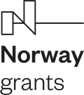

<h2>Partneři projektu</h2>

Kancelář vybuduje nové partnerství s Norwegian National Human Rights Institution, která působí jako norská národní lidskoprávní instituce (dále jen &bdquo;NHRI&ldquo;) a má zkušenosti s uplatňováním lidskoprávního přístupu ve své činnosti. Zaměstnanci Kanceláře navštíví tuto norskou instituci, aby získali know-how, příklady dobré praxe a inspirovali se v metodách práce.

<h2>Stručný popis projektu</h2>

Veřejný ochránce práv (dále jen &bdquo;ochránce&ldquo;) dle zákona č. 349/1999 Sb., o veřejném ochránci práv, ve znění pozdějších předpisů, od samého počátku chrání osoby před jednáním vybraných veřejných úřadů a institucí, čímž má dle výslovného zákonného požadavku přispívat k ochraně základních práv a svobod. Jeho referenčním rámcem má být nejen prostá zákonnost, nýbrž vedle principů dobré správy rovněž principy demokratického právního státu, mezi něž v moderních demokraciích neodmyslitelně patří ochrana základních práv a svobod. V následujících letech se navíc působnost ochránce rozrostla o výsostně lidskoprávní agendy jako je např. ochrana osob omezených na svobodě a agenda rovného zacházení a ochrany před diskriminací.

Současný stav je takový, že ochránce, resp. Kancelář veřejného ochránce práv (dále jen &bdquo;Kancelář&ldquo;), která plní úkoly spojené s odborným, organizačním a technickým zabezpečením činnosti ochránce, má k dispozici dostatečné zdroje na pokrytí výkonu svých základních úkolů. Nedostává se však dalších prostředků na širší okruh aktivit s plošným celospolečenským dopadem, které by přispívaly k systémovým změnám.

<h2>Cíl projektu</h2>

Projekt cílí na vyvážení zmiňovaného stavu tím, že personálně posiluje čtyři odbory Kanceláře:

<ul>
	<li>Posílení činnosti sekretariátu ochránce a jeho zástupce s cílem důsledně a systematicky uplatňovat mezinárodní a ústavní standardy ochrany lidských práv ve výstupech ochránce;</li>
	<li>Posílení prevence špatného zacházení (odbor dohledu nad omezováním osobní svobody);</li>
	<li>Posílení ochrany ohrožených dětí a jejich rodin a podpora práv dětí (odbor rodiny, zdravotnictví a práce) a</li>
	<li>Posílení práva na rovné zacházení a ochranu před diskriminací (odbor rovného zacházení).</li>
</ul>

<strong>Tento předem definovaný projekt pod registračním číslem LP-PDP3-001 je financován z Norských fondů 2014 &ndash; 2021</strong> (program Lidská práva) a umožní provádění analytické, výzkumné a osvětové činnosti, které napomohou zlepšení situace ohrožených a marginalizovaných skupin, a to jak z hlediska ochrany jejich práv, tak z hlediska získávání kompetencí při jejich prosazování.

<h2>Aktuality</h2>

<ul>
	<li>
	
28.1.2022 &ndash; o zrealizovaném výzkumu Občané EU v&nbsp;České republice se můžete dočíst i <a href="https://pravo21.cz/spolecnost/obcane-eu-se-v-cesku-casto-setkavaji-s-diskriminaci-potvrdil-vyzkum-ombudsmana">zde</a>.

	</li>
	<li>K&nbsp;15.12.2021, tj. za 6. monitorovací období zveřejňujeme odborné výstupy sekretariátu ochránce a jeho zástupkyně. Jedná se o <a href="sankce-prispevek-na-peci.pdf">sankční materiál na vládu</a> (problematika aktuálně účinné právní úpravy příspěvku na péči), <a href="sankce-vyrazeni-z-up.pdf">sankční materiál na vládu</a> (nezákonný postup krajských poboček ÚP a MPSV při vyřazování uchazeče o zaměstnání z&nbsp;evidence uchazečů o zaměstnání a nepřiznání nároku na podporu v&nbsp;nezaměstnanosti), <a href="sankce-dlouhodoby-pobyt.pdf">sankční materiál na vládu</a> (nezákonný postup OAMP MV při zastavení řízení o žádosti o vydání povolení k dlouhodobému pobytu), dále o <a href="vyjadreni_us_94.pdf">vyjádření vedlejšího účastníka v řízení před ÚS</a> (návrh na zrušení &sect; 94 písm. a) zákona č. 6/2002 Sb. pro rozpor s&nbsp;ústavním pořádkem), o <a href="vyjadreni_us_111.pdf">vyjádření vedlejšího účastníka v řízení před ÚS</a>(návrh na zrušení vybraných ustanovení zákonů č. 111/2006 Sb. a č. 251/2016 Sb. pro rozpor s&nbsp;ústavním pořádkem), o <a href="zprava_o_cinnosti_vop_za_3._ctvrtleti_2021.docx">zprávu VOP o činnosti za III. čtvrtletí 2021 </a> (zahrnutí samostatné části obsahující stěžejní informace o aktuální fázi realizace projektu v&nbsp;KVOP) a o <a href="novela_zakona_o_ssp-pripominky-mpsv.docx">legislativní připomínky</a> (připomínky VOP k návrhu zákona, kterým se mění zákon č.&nbsp;117/1995 Sb.).</li>
	<li>K&nbsp;12.11.2021 zveřejňujeme <a href="obcane_evropske_unie_v_cesku-studie-mindbridge.pdf">analytickou zprávu z výzkumu Občané Evropské unie v České republice</a>, jejímž cílem je prozkoumat zkušenosti migrujících pracovníků EU a jejich rodinných příslušníků, kteří v&nbsp;současné době pobývají v&nbsp;ČR, v&nbsp;různých oblastech života. V&nbsp;návaznosti na výzkumnou zprávu zveřejňujeme <a href="obcane_evropske_unie_v_cesku.docx">Doporučení</a>, jehož smyslem je využít poznatky vzešlé z analytické zprávy výzkumu a z činnosti ochránce a na základě nich navrhnout jednotlivá dílčí doporučení, která by pomohla nevyhovující situaci zlepšit. Dokumenty lze nalézt i v <a href="https://eso.ochrance.cz/Nalezene/Edit/9920">Evidenci stanovisek ombudsmana</a>.&nbsp;</li>
	<li>14.10.2021 - dnes jsme započali třídenní on-line setkání s norským partnerem&nbsp;Norges institusjon for menneskerettigheter. Interaktivní workshop jsme zaměřili na téma&nbsp;&bdquo;Paris Principles in Practice&ldquo;.&nbsp;</li>
</ul>

<ul>
	<li>8.10.2021 &ndash; zveřejňujeme informační leták pro děti &quot;<a href="/media/jsem_v_psychiatricke_nemocnici.pdf">Jsem v psychiatrické nemocnici (léčebně)</a>&quot;.</li>
	<li>7.10.2021 &ndash; zveřejňujeme<a href="/media/zprava_o_setreni_a_doporuceni_ve_veci_vyhledavani_obecnych_pestounu.pdf"> Doporučení zástupkyně veřejného ochránce práv ve věci vyhledávání obecných pěstounů a osvojitelů pro děti v pěstounské péči na přechodnou dobu</a>, včetně <a href="/media/vyhledavani_obecnych_pestounu_a_osvojitelu_detem_v_prechodne_pestounske_peci.pdf">výzkumné zprávy</a>. Cílem je poskytnout veřejné správě zpětnou vazbu a doporučení v oblasti zprostředkování pěstounské péče a osvojení. O výsledcích budou informovány jednotlivé úřady a taktéž Ministerstvo práce a sociálních věcí, které úřady metodicky v této oblasti vede, a je tedy odpovědné za případné usměrnění roztříštěné správní praxe.</li>
	<li>k 15.8.2021, tj. za 5. monitorovací období, zveřejňujeme odborné výstupy sekretariátu ochránce a jeho zástupkyně. Jedná se o<a href="/media/ii_material_szd_11-2021-cb_sankce_vlade.pdf"> sankční materiál na vládu týkající se problematiky neregistrovaného zařízení poskytujícího sociální služby</a>, dále o <a href="/media/14-2021-szd-jcz-_vyjadreni_k_navrhu_k_us.pdf">vyjádření vedlejšího účastníka v řízení o zrušení ustanovení &sect; 155 odst. 4 a odst. 5 zákona č. 541/2020 Sb., o odpadech, ve znění pozdějších předpisů</a> a o <a href="/media/20-2021-szd-dk.pdf">návrh k Ústavnímu soudu na zrušení ustanovení bodu 80 v části vymezené ve sloupci druhém přílohy č. 4 nařízení vlády č. 278/2008 Sb., o obsahových náplních jednotlivých živností, ve znění pozdějších předpisů</a>.</li>
	<li>12.8.2021 zveřejňujeme <a href="/media/doporuceni_detska_psychiatrie.pdf">Doporučení ZVOP Účast dítěte na rozhodování o záležitostech souvisejících s jeho hospitalizací na psychiatrii</a>. Tiskovou zprávu související s Doporučením naleznete <a href="https://www.ochrance.cz/aktualne/deti_maji_pravo_pred_hospitalizaci_na_psychiatrii_i_behem_lecby_vyjadrit_svuj_nazor/">zde</a>.</li>
	<li>K 30.6.2021 zveřejňujeme <a href="https://www.ochrance.cz/aktualne/ombudsman_vydal_prvni_z_rady_monitorovacich_zprav_o_rovnem_zachazeni_ctyrlety_projekt_sleduje_vzdelavani_romu_rovne_odmenovani_zen_a_muzu_a_procesni_otazky/">tiskovou zprávu</a> k vydání první monitorovací zprávy o rovném zacházení. V úvodní monitorovací zprávě o rovném zacházení představujeme tři oblasti, které bude veřejný ochránce práv do roku 2023 systematicky sledovat. Monitorovací zprávu můžete nalézt <a href="dis-dj-monitorovaci_zprava.pdf.pdf">zde</a>.</li>
	<li>K 15.4.2021, tj. za čtvrté monitorovací období projektu, zveřejňujeme odborné výstupy sekretariátu ochránce a jeho zástupkyně. Jedná se o <a href="1_37-2020-SZD-advokatni-tarif.pdf">návrh Ústavnímu soudu</a> na zrušení ust. &sect; 9 odst. 5 vyhlášky č. 177/1996 Sb., advokátní tarif, z důvodu nesouladu s ustálenou judikaturou ÚS a zásadou rovnosti, dále jde o <a href="2_vlada-vyrazeni-z-uradu-prace.pdf">materiál na vládu k problematice evidence ÚP uchazečů o zaměstnání</a> a o <a href="3_US-zakon-VTOS.pdf">vyjádření vedlejšího účastníka v řízení</a> o zrušení ustanovení &sect; &sect; 52 odst. 4 zákona č. 169/1999 Sb., o výkonu trestu odnětí svobody. Další v pořadí je <a href="4_4-ENNHRI_Questionnare_ECtHR-third-party-intervention_final_cs_final.pdf">materiál k dotazníku organizace ENNHRI</a> týkající se sběru informací pro litigaci v případu Duarte Agostinho a ostatní proti Portugalsku a dalším před ESLP a <a href="5_Rule-of-Law-Consultation-2021-Questionnaire_CZ_cs_final.pdf">roční report o stavu vlády práva v České republice</a> v roce 2020 pro ENNHRI.</li>
	<li>14.4.2021 &ndash; zveřejňujeme <a href="6_Doporuceni-ochrance-ve-veci-deinstitucionalizace-pece-o-male-deti.pdf">Doporučení veřejného ochránce práv ve věci deinstitucionalizace péče o malé děti</a> a <a href="7_Doporuceni-ochrance-ve-veci-zvyseni-odmen-pestounum-na-prechodnou-dobu.pdf">Doporučení veřejného ochránce práv ve věci zvýšení odměn pěstounům na přechodnou dobu</a>.</li>
	<li>22.3.2021 &ndash; přehledný <a href="https://deti.ochrance.cz/media/letak_-_ombudsman_detem_cestina_.pdf">leták pro děti</a>, který popisuje, kdo je ombudsman, ve kterých situacích může pomáhat dětem a jak se na něj mohou děti obrátit, máme v několika jazykových variantách. Anglický leták&nbsp;je ke stažení <a href="https://www.ochrance.cz/uploads-deti/user_upload/Prilohy/ombudsman_detem/Letak_-_Ombudsman_detem__anglictina_.pdf">zde</a>, německý <a href="https://www.ochrance.cz/uploads-deti/user_upload/Prilohy/ombudsman_detem/Letak_-_Ombudsman_detem__nemcina_-_anglicke_logo_.pdf">zde</a>, romský <a href="https://www.ochrance.cz/uploads-deti/user_upload/Prilohy/ombudsman_detem/Letak_-_Ombudsman_detem__romstina_.pdf">zde </a>a ruský&nbsp;<a href="https://www.ochrance.cz/uploads-deti/user_upload/Prilohy/ombudsman_detem/Letak_-_Ombudsman_detem__rustina_-_anglicke_logo_.pdf">zde</a>.</li>
	<li>1.2.2021 &ndash;&nbsp;pustili jsme do&nbsp;světa sociálních sítí první osvětové video. Jde o&nbsp;pilotní díl připravované minisérie, která představí práci kanceláře ombudsmana pomocí krátkých videí určených především dětem a&nbsp;dospívajícím. Podívat se na&nbsp;něj můžete&nbsp;<a href="https://www.youtube.com/watch?v=iiw2OM4jDbA">zde</a>.</li>
</ul>

<h2>Co jsme realizovali v roce 2020 v rámci projektu</h2>

<ul>
	<li>18.12.2020 &ndash;&nbsp;zveřejňujeme doporučení zástupkyně veřejného ochránce práv ke&nbsp;kontaktům dítěte v&nbsp;pěstounské péči nejen s&nbsp;rodiči&nbsp;<a href="https://www.ochrance.cz/uploads-import/Kancelar/projekty/4._MO_1._doporuceni_rodina_VI_6985-20-VOP-PS.pdf">&nbsp;zde</a>. Doporučení má za&nbsp;cíl přispět k&nbsp;dodržování práv dětí svěřených do&nbsp;pěstounské péče. Primárně je určeno pro rodiče dětí, pěstouny, doprovázející organizace pěstounů, organizace pomáhající rodičům, orgány sociálně-právní ochrany dětí a&nbsp;soudy.</li>
	<li>K 15.12.2020, tj. za&nbsp;třetí monitorovací období projektu, zveřejňujeme odborné výstupy sekretariátu ochránce a&nbsp;jeho zástupkyně. Jedná se o&nbsp;Analýzu k&nbsp;navrhování kandidátů do&nbsp;Výborů OSN&nbsp;<a href="https://www.ochrance.cz/uploads-import/Kancelar/projekty/3._MO_1.Analyza_k_navrhovani_kandidatu_do_vyboru_OSN_s_logy.pdf">&nbsp;zde</a>, dále o&nbsp;připomínky&nbsp;k&nbsp;návrhu novely zákona o&nbsp;ochraně veřejného zdraví s&nbsp;ohledem na&nbsp;pandemickou situaci&nbsp;<a href="https://www.ochrance.cz/uploads-import/Kancelar/projekty/3._MO_2._51333_2020_MZCR_Ochrana_verejneho_zdravi_pripominky.pdf">&nbsp;zde</a>. Dále jde o&nbsp;dvě vyrozumění veřejného ochránce práv vládě ČR k&nbsp;problematice týkající se osob bez státní příslušnosti&nbsp;<a href="https://www.ochrance.cz/uploads-import/Kancelar/projekty/3._MO_3.SZD_32-2020__osoby_bez_statni_prislusnosti_.pdf">&nbsp;zde</a>&nbsp;a&nbsp;<a href="https://www.ochrance.cz/uploads-import/Kancelar/projekty/3._MO_4.SZD_33-2020__osoby_bez_statni_prislusnosti_.pdf">&nbsp;zde</a>&nbsp;a&nbsp;o&nbsp;vyjádření veřejného ochránce práv k&nbsp;individuální ústavní stížnosti, v&nbsp;němž byly sděleny poznatky k&nbsp;některým aspektům účinného vyšetřování násilí na&nbsp;vězněných osobách<a href="https://www.ochrance.cz/uploads-import/Kancelar/projekty/3._MO_5.SZD_29-2020-LH_anon.pdf">&nbsp;zde</a>.</li>
	<li>10.11.2020 &ndash;&nbsp;nachystali jsme další informační materiál v&nbsp;rámci osvěty dětí a&nbsp;mládeže. Přehledný leták popisuje kdo je ombudsman, ve&nbsp;kterých situacích může pomáhat dětem a&nbsp;jak se na&nbsp;něj mohou děti obrátit. Leták je ke zhlédnutí&nbsp;<a href="https://deti.ochrance.cz/media/letak_-_ombudsman_detem_cestina_.pdf">zde</a>.</li>
	<li>K 15.8.2020, tj. za&nbsp;druhé monitorovací období projektu, zveřejňujeme odborné výstupy sekretariátu ochránce a&nbsp;jeho zástupkyně. Jedná se o&nbsp;vyjádření veřejného ochránce práv jako vedlejšího účastníka k&nbsp;návrhu na&nbsp;zrušení části usnesení Vlády ČR u&nbsp;Ústavního soudu, který se týkal pravidel přeshraničního styku pro&nbsp;tzv. pendlery a&nbsp;další osoby. Ve&nbsp;vyjádření byl podpořen návrh skupiny senátorů na&nbsp;zrušení části usnesení vlády týkající se přeshraničních pracovníků během koronavirové krize<a href="https://www.ochrance.cz/uploads-import/Kancelar/projekty/2._MZ_1_vyjadreni_k_navrhu_logo_KVOP.pdf">&nbsp;zde</a>. A&nbsp;o&nbsp;vyjádření pro&nbsp;experty OSN (<em>Special Procedures</em>) o&nbsp;tom, jak byla v&nbsp;České republice dodržována lidská práva v&nbsp;průběhu koronavirové krize. Zpráva se zaměřuje na&nbsp;řadu oblastí, např.&nbsp;dopad na&nbsp;klienty cestovních kanceláří, otázku omezení přítomnosti otců u&nbsp;porodu, situaci přeshraničních pracovníků, studentů, situaci ve&nbsp;vězeňství<a href="https://www.ochrance.cz/uploads-import/Kancelar/projekty/CZ_2._MZ_2_Czech_Republic_join_questionnaire_COVID_Report_s_logy.pdf">&nbsp;zde</a>.</li>
	<li>29.7.2020 jsme uskutečnili interní školení pro právníky a&nbsp;právničky&nbsp;Kanceláře, které se skládalo z&nbsp;prezentace&nbsp;jak teoretických lidskoprávních východisek, tak aplikace lidskoprávní argumentace v&nbsp;praxi činnosti Kanceláře.</li>
</ul>

<ul>
	<li>V červenci 2020 jsme vytvořili, pro&nbsp;zlepšení informovanosti dětí o&nbsp;jejich právech a&nbsp;povinnostech, speciální leták. Dotýká se dětí žijících v&nbsp;dětských domovech, či&nbsp;výchovných ústavech a&nbsp;naleznete jej&nbsp;<a href="https://deti.ochrance.cz/media/jsem_v_dd_nebo_vu-prezentace_na_web_prezentace.pdf">zde</a>.</li>
	<li>Dne 23.6.2020 jsme v&nbsp;rámci projektu započali cyklus vzdělávacích seminářů, tentokrát pro pracovníky v&nbsp;sociální oblasti. Prvním tématem byly vybrané otázky a&nbsp;odpovědi na&nbsp;poli sociálně-právní ochrany a&nbsp;náhradní rodinné péče. Další informace o&nbsp;semináři naleznete&nbsp;<a href="https://www.ochrance.cz/uploads-import/Kancelar/projekty/06_23_Vybrane_otazky_a_odpovedi_ze_socialne-pravni_ochrany_a_nahradni_rodinne_pece_POZVANKA.pdf">&nbsp;zde</a>.</li>
</ul>

<ul>
	<li>K 15.4.2020, tj. za&nbsp;první monitorovací období projektu, zveřejňujeme odborné výstupy sekretariátu ochránce a&nbsp;jeho zástupkyně. Jedná se o&nbsp;vyjádření pro Výbor pro sociální, hospodářská a&nbsp;kulturní práva OSN&nbsp;<a href="https://www.ochrance.cz/uploads-import/Kancelar/projekty/CZ_1.Report_Commitee_on_ESC_rights_s_logy_cs_final.pdf">&nbsp;zde</a>,&nbsp;vyjádření veřejné ochránkyně práv ke&nbsp;kasační stížnosti k&nbsp;NSS ČR&nbsp;<a href="https://www.ochrance.cz/uploads-import/Kancelar/projekty/2._Amicus_curiae_k_NSS_jen_logo_KVOP.pdf">&nbsp;zde</a>,&nbsp;vyjádření zástupkyně veřejného ochránce práv jako kolizní opatrovnice k&nbsp;ústavní stížnosti adresované ÚS ČR&nbsp;<a href="https://www.ochrance.cz/uploads-import/Kancelar/projekty/3.Vyjadreni_US__opatrovnictvi_ZVOP_final_jen_logo_KVOP.pdf">&nbsp;zde</a>, připomínky v&nbsp;legislativním procesu k&nbsp;návrhu zákona o&nbsp;občanských průkazech&nbsp;<a href="https://www.ochrance.cz/uploads-import/Kancelar/projekty/4._Postaveni_rodinnych_prislusniku_obcanu_CR__final__jen_logo_KVOP.pdf">&nbsp;zde</a>&nbsp;a přílohy ke&nbsp;zprávě ombudsmanky pro Poslaneckou sněmovnu za&nbsp;4.&nbsp;čtvrtletí roku&nbsp;2019<a href="https://www.ochrance.cz/uploads-import/Kancelar/projekty/6.2678-2020_zprava_ombudsmanky_2019_IV.Q_10_let_ombudsmana-equality_body_jen_logo_KVOP.pdf">&nbsp;zde</a>.</li>
	<li>Dne 5.3.2020 jsme v&nbsp;rámci projektu započali cyklus vzdělávacích seminářů pro pracovníky zařízení, kde se nacházejí nebo mohou nacházet osoby omezené na&nbsp;osobní svobodě. Prvním tématem byly poznatky ze&nbsp;systematických návštěv zařízení pro děti vyžadující okamžitou pomoc. Odborný seminář zahájila zástupkyně veřejného ochránce práv Monika Šimůnková. Další informace o&nbsp;semináři naleznete<a href="https://www.ochrance.cz/uploads-import/Kancelar/projekty/03_05_Poznatky_ze_systematickych_navstev_ZDVOP_POZVANKA.pdf">&nbsp;zde</a>.</li>
</ul>

<ul>
	<li>Dne 15.1.2020 jsme uspořádali zahajovací tiskovou konferenci, kde veřejná ochránkyně práv Anna Šabatová představila projekt Posílení aktivit veřejného ochránce práv v&nbsp;ochraně lidských práv. Přítomným novinářům přiblížila jeho cíle s&nbsp;akcentem na&nbsp;mezinárodní spolupráci. Tiskovou zprávu máte možnost shlédnout&nbsp;<a href="https://www.ochrance.cz/aktualne/tiskove-zpravy-2020/projekt-posileni-aktivit-verejneho-ochrance-prav-v-ochrane-lidskych-prav/">zde</a>.</li>
</ul>

<a href="https://www.eeagrants.cz/">https://www.eeagrants.cz/</a>

