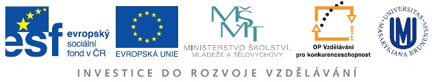

## Centrum ekonomických a právních studií Masarykovy univerzity

(reg.č. CZ.1.07/2.4.00/12.0055, Operační program Vzdělávání pro konkurenceschopnost, Oblast podpory 2.4 Partnerství a sítě)

Mezifakultní projekt, který Ekonomicko-správní fakulta realizuje ve spolupráci s Právnickou fakultou.

[www.ceps.muni.cz](http://www.ceps.muni.cz/)

## Teorie - dovednosti - praxe: inovace studia práva

(reg.č. CZ.1.07/2.2.00/15.0198, Operační program Vzdělávání pro konkurenceschopnost, Oblast podpory 2.2 Vysokoškolské vzdělávání)

Cílem projektu je zvýšení konkurenceschopnosti studentů magisterského studijního programu Právo a právní věda, obor Právo na Právnické fakultě Masarykovy univerzity inovací studijního plánu.

[dovednosti.law.muni.cz](http://dovednosti.law.muni.cz/)

