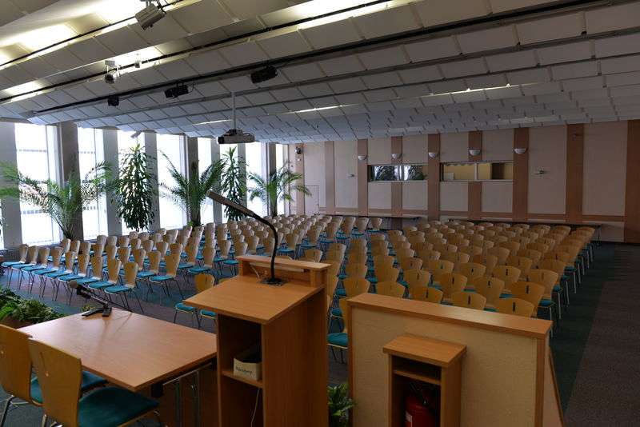

# Velký sál

<!--StartFragment-->

## Obecné informace o sálu

## <!--StartFragment-->

* Sál je vhodný pro pořádání seminářů, konferencí, koncertů, hudebních programů (solidní akustika), apod.
* Prostor je vybaven stoly + židlemi, pódiem. Max. kapacita při školní úpravě je 144 míst, při koncertní úpravě 216 míst.
* Rozměr sálu: šířka místnosti: 16 m, délka místnosti: 19 m
* Standardní vybavení AV technikou: dataprojektor vč. promítacího plátna, notebook, ozvučení az 7 mikrofony, WiFi, flipchart, klavír
* Sál je klimatizován, možnost zatemnění sálu
* V sále je zákaz konzumace jídla a nápojů
* Pro podání pohoštění či neformální setkání je možno využít předsálí

<!--EndFragment-->\
<!--StartFragment-->

## Dispoziční možnosti

<!--EndFragment-->

[Školní úprava](https://www.ochrance.cz/fileadmin/user_upload/img/Saly/VS_skolni_uprava_144_osob.pdf)

[Koncertní úprava](https://www.ochrance.cz/fileadmin/user_upload/img/Saly/VS_koncertni_uprava_216_osob.pdf)

