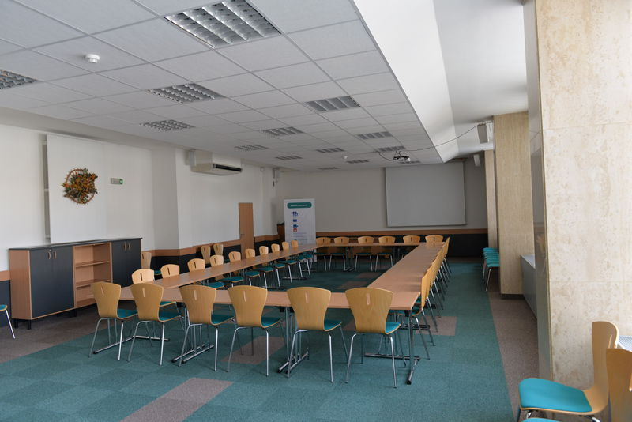

<h2>Velký sál</h2>

<h3>Obecné informace o&nbsp;sálu</h3>

<ul>
	<li>Sál je vhodný pro pořádání seminářů, konferencí, koncertů, hudebních programů (solidní akustika), apod.</li>
	<li>Prostor je vybaven stoly +&nbsp;židlemi, pódiem. Max. kapacita při školní úpravě je 144&nbsp;míst, při koncertní úpravě 216&nbsp;míst.</li>
	<li>Rozměr sálu: šířka místnosti: 16&nbsp;m, délka místnosti: 19&nbsp;m</li>
	<li>Standardní vybavení AV technikou: dataprojektor vč. promítacího plátna, notebook, ozvučení az 7&nbsp;mikrofony, WiFi, flipchart, klavír</li>
	<li>Sál je klimatizován, možnost zatemnění sálu</li>
	<li>V sále je zákaz konzumace jídla a&nbsp;nápojů</li>
	<li>Pro podání pohoštění či&nbsp;neformální setkání je možno využít předsálí</li>
</ul>

<h3>Dispoziční možnosti</h3>

<a href="/uploads-import/img/Saly/VS_skolni_uprava_144_osob.pdf">Školní úprava</a>

<a href="/uploads-import/img/Saly/VS_koncertni_uprava_216_osob.pdf">Koncertní úprava</a>

<h2>Malý sál</h2>

<h3>Obecné informace o&nbsp;sálu</h3>

Sál je vhodný pro pořádání seminářů, konferencí, apod.

<ul>
	<li>Prostor je vybaven stoly +&nbsp;židlemi. Max. kapacita při školní úpravě je 64&nbsp;míst, při koncertní úpravě 70&nbsp;míst.</li>
	<li>Rozměr sálu: šířka místnosti: 8&nbsp;m, délka místnosti: 17&nbsp;m</li>
	<li>Standardní vybavení AV technikou: dataprojektor vč. promítacího plátna, notebook, ozvučení &ndash;&nbsp;2&nbsp;mikrofony, WiFi, flipchart</li>
	<li>Sál je klimatizován</li>
	<li>V sále je zákaz konzumace jídla a&nbsp;nápojů</li>
	<li>Pro podání pohoštění či&nbsp;neformální setkání je možno využít předsálí</li>
</ul>

<h2>Předsálí</h2>

<h3>Obecné informace o&nbsp;předsálí</h3>

<ul>
	<li>K pronájmu sálů se automaticky připočítává pronájem předsálí</li>
	<li>Předsálí je vhodné využít zejména pro prezentace a&nbsp;podání pohoštění</li>
	<li>Rozměr předsálí: šířka místnosti: 10&nbsp;m, délka místnosti: 21&nbsp;m</li>
	<li>Uzamykatelná šatna bez obsluhy, toalety, stoly +&nbsp;židle na&nbsp;případné občerstvení účastníků akce</li>
	<li>Z provozně-technických důvodů je možné využít cateringových služeb pouze u&nbsp;našeho provozovatele kantýny. Jde o&nbsp;paní Hanu Kobelkovou, tel: 604&nbsp;906&nbsp;046, e-mail:&nbsp;<a href="mailto:Hana.Kobelkova@email.cz">Hana.Kobelkova@email.cz</a></li>
</ul>

<h2>Tiskové středisko</h2>

<h3>Obecné informace o&nbsp;tiskovém středisku</h3>

<ul>
	<li>Tiskové středisko je vhodné pro pořádání seminářů, kulatých stolů</li>
	<li>Prostor je vybaven stoly +&nbsp;židlemi, max. kapacita do&nbsp;25&nbsp;osob</li>
	<li>Rozměr tiskového střediska:</li>
	<li>Standardní vybavení AV technikou: dataprojektor vč. promítacího plátna, notebook, ozvučení, WiFi, flipchart</li>
	<li>Prostor je klimatizován</li>
	<li>Pro podání drobného pohoštění je možno využít prostoru před TS</li>
</ul>

<h2>Víceúčelová místnost</h2>

<h3>Obecné informace o víceúčelové místnosti</h3>

<ul>
	<li>Víceúčelová místnost je vhodná pro sportovní aktivity (aerobic, jóga, pilates), pro taneční tréninky</li>
	<li>Místnost se nachází v&nbsp;přízemí budovy</li>
	<li>Max. kapacita do&nbsp;20&nbsp;osob</li>
	<li>Rozměry místnosti: šířka místnosti: 14&nbsp;m, délka místnosti: 14&nbsp;m</li>
	<li>Zrdcadlová stěna</li>
	<li>K dispozici jsou karimatky, činky, overball, aerobic step bedýnky</li>
</ul>

<h3><a href="/uploads-import/img/Saly/Cenik_komercni_2020.pdf">Komerční ceník</a></h3>

<h3><a href="nekomercni_cenik_2022.pdf">Nekomerční ceník</a></h3>

<h2>Kontaktní osoba</h2>

Markéta Svobodová

sekretariát vedoucího kanceláře

Tel: 542&nbsp;542&nbsp;555

E-mail: marketa.svobodova@ochrance.cz

