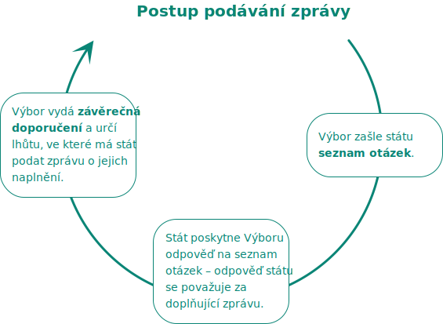

V rámci  monitorování [Úmluvy](https://www.mpsv.cz/documents/20142/225526/Umluva_o_pravech_osob_se_ZP.pdf/1e95a34b-cbdf-0829-3da2-148865b8a4a8) provádíme výzkumy, šetření a vypracováváme doporučení ke zlepšení situace lidí s postižením. Intenzivně přitom spolupracujeme právě s lidmi s postižením, neziskovými organizacemi a především s **poradním orgánem ombudsmana pro oblast práv lidí s postižením**.

Spolupracujeme také s organizacemi, které monitorují dodržování Úmluvy v jiných státech. Jsme součástí pracovní skupiny k Úmluvě při Evropské síti národních lidskoprávních organizací (ENNHRI).

Naším cílem je posilovat přístupnost informací pro všechny bez rozdílu. Jako první a jediní v České republice jsme proto přeložili celou [Úmluvu OSN do znakového jazyka](/umluva/) a snažíme se zpřístupňovat informace [ve formě pro snadné čtení](mezinarodni_umluva_ETR.pdf).



* **předkládá** ombudsmanovi **systémová témata** v oblasti ochrany práv lidí s postižením,
* **poskytuje** ombudsmanovi **konzultace** a praktické informace,
* podílí se na **připomínkování právních předpisů** ombudsmanem a zaujímá stanoviska k jeho strategickým dokumentům týkajícím se práv lidí s postižením,
* **získává podněty** od lidí s postižením, organizací hájících jejich práva a od pečujících osob,
* **zajišťuje informovanost** lidí s postižením, organizací hájící jejich práva a široké veřejnosti o činnost ombudsmana v oblasti monitorování podle Úmluvy.



Poradní orgán má 17 členů. Jeho členy jsou lidé s postižením a lidé hájící práva lidí s postižením. Při jmenování členů poradního orgánu přihlíží ombudsman zejména k jejich **odbornosti a angažovanosti v oblasti ochrany práv lidí s postižením**.

#### (1) Eva Liberdová

Od narození má těžkou ztrátu sluchu, od 17 let je uživatelkou kochleárního implantátu. V letech 2008 – 2015 působila v oblasti sociálních služeb pro lidi s mentálním postižením. Ve dle toho se ve volném čase věnovala osvětě o důsledcích sluchové vady, stejně tak i lektorské, přednáškové a publikační činnosti jak pro laickou, tak odbornou veřejnost ve prospěch lidí se sluchovým postižením. Od roku 2015 působí jako sociální pracovnice a metodička, což ji umožňuje věnovat se problematice práv lidí se sluchovým postižením naplno. Zabývá se především problematikou komunikačních potřeb a přístupnosti. S lektorskou, přednáškovou a publikační aktivitou pokračuje nadále.

#### (2) Ivana Marešová

Ivana Marešová se narodila 28. 3. 1963 v Čisovicích u Prahy, vystudovala gymnázium pro tělesně postižené v Bratislavě a následně vysokou školu – právnickou fakultu na Karlově univerzitě, kde v roce 1989 získala doktorát.

Pracovní zkušenosti se jí dle jejích slov dlouho vyhýbaly. První práci se jí podařilo získat až v roce 1993, do té doby prakticky všichni zaměstnavatelé měli strach zaměstnat člověka s rozsahem jejího postižení. Za zmínku stojí určitě Sbor zástupců zdravotně postižených, kam nastoupila právě v 93. roce. Následovalo Sdružení slabozrakých a nevidomých, společnost Remedium a v neposlední řadě sdružení Muži a Ženy o.p.s, kde pracuje od roku 2014 až dosud. Zároveň se věnuje právní poradně na gymnáziu Budějovická v Praze.

Spolupracovala na projektu Živá knížka pro Amnesty international.

Ve volném čase, pokud mi jí zbyde, se ráda věnuje turistice, přírodě, literatuře, návštěvám divadelních představení či společenským hrám.

#### (3) Jiří Morávek

Absolvent Pedagogické fakulty univerzity v Hradci Králové v oboru sociální pedagog. Pro lidi se zdravotním postižením pracuje na různých pozicích již od roku 1986. V současné době je ředitelem Centra pro integraci osob se zdravotním postižením Královéhradeckého kraje, jehož sídlo bylo vybudováno v roce 2015. Cílem centra je pomáhat lidem se zdravotním postižením ohroženým sociální exkluzí v zapojení se do běžného života. V roce 2004 byl zvolen do předsednictva Národní rady osob se zdravotním postižením ČR a jako místopředseda zajišťoval koordinaci činností v jednotlivých krajích ČR. Od roku 2012 pracuje jako statutární zástupce a 1. místopředseda NRZP ČR. Je členem Vládního výboru pro osoby se zdravotním postižením, řídícího výboru národního rozvojového programu mobility pro všechny a odborné skupiny pro zaměstnávání osob se zdravotním postižením. Zabývá se především obhajobou, prosazováním a naplňováním práv, zájmů a potřeb lidí se zdravotním postižením.

#### (4) Luboš Zajíc

Vystudoval Konzervatoř Jana Deyla. Po absolutoriu pokračoval v práci učitele hudby v základní umělecké škole v Praze 4. Profesi učitele hudby se, byť na malý pracovní úvazek, se věnuje dodnes. K zájmu o práci v poradním orgánu VOP jej přivedlo jeho druhé profesní zaměření, na jehož začátku stálo absolvování magisterského oboru právo a právní věda na pražské Právnické fakultě Univerzity Karlovy. V roce 2009 jsem se stal pracovníkem pražské sociálně právní poradny Sjednocené organizace nevidomých a slabozrakých ČR (SONS). V rámci poradny se kromě práce s klienty, začal postupně věnovat i pravidelné publikaci článků zaměřených na sociálně právní problematiku s dopadem na osoby s těžkým zrakovým postižením a připomínkování legislativy s dopadem na stejnou cílovou skupinu. Když v roce 2014 Evropská unie nevidomých vytvářela síť zástupců jednotlivých zemí, aby v rámci iniciativ této organizace sledovala provádění Úmluvy o právech osob se zdravotním postižením v jednotlivých zemích, byl za českou SONS nominován do této funkce. Díky tomu se zintenzivnil i jeho zájem o tuto problematiku. Je členem Republikové rady SONS ČR, z. s., tedy organizace reprezentující a hájící zájmy osob s těžkým zrakovým postižením. Věří, že jeho právní vzdělání a zkušenost s připomínkováním sociálně právní legislativy mu umožní přetavovat reálné životní problémy osob s těžkým zrakovým postižením v konstruktivní připomínky či návrhy, které mohou přinést lidem z této komunity zlepšení jejich života a postavení ve společnosti.

#### (5) Maxim Pachomov

Poslední tři roky pracuje ve VZP ČR. Během letních měsíců organizuje letní kino pro veřejnost v industriální oblasti Dolní oblast Vítkovice a Landek Parku. V městské oblasti Petřkovice působí jako radní. Jak sám říká, poranění míchy v důsledku pádu na motorce před 11 lety a ochrnutí od pasu dolů, jej přivedlo do sociální oblasti. Před čtyřmi lety se stal členem Komise rady MSK kraje pro občany se zdravotním postižením. Před dvěma lety se přihlásil ke studiu na Ostravské univerzitě obor Sociální práce. Volný čas rád tráví se svým rotvajlerem nebo projížďkou na čtyřkolce nebo v autě – je vášnivý motorista.

#### (6) Jiří Černý

Jako člověk s těžkým zrakovým postižením se dlouhodobě zasazuje o práva lidí s postižením. Je právníkem a externím doktorandem Katedry pracovního práva a práva sociálního zabezpečení Právnické fakulty Univerzity Karlovy. V připravované disertační práci se zaměřuje na analýzu a návrhy změn české právní úpravy zaměstnávání lidí s postižením. Osvětě se věnuje od roku 2007, z toho od roku 2013 na aktivní profesní a akademické úrovni i publikační úrovni. Od roku 2018 je právníkem odborného sociálního poradenství pod organizací Quip, kde především zastupuje lidi s psychickým postižením a duševním onemocněním v soudních řízeních o nezpůsobilosti zletilého právně jednat zjednodušeně, kde pomáhá klientům rozsah omezení svéprávnosti co nejvíce zmírnit a nahradit mírnějším opatřením. Mimo Quip se věnuje například univerzálnímu designu a přístupnosti města pro všechny, aktuálně např. pro hl. m. Prahu. Ve volném čase usiluje o větší povědomí veřejnosti o handicapu, odstraňování špatné praxe, diskriminace, mýtů a překonaných přístupů k handicapu, usiluje o prosazování deinstitucionalizace a transformace sociálních služeb, obecně podstatnou částí jeho činnosti je snaha o úplné naplňování Úmluvy o právech osob se zdravotním postižením Českou republikou. Problematikou práv lidí s postižením se zabýval také jako člen poradního orgánu bývalé veřejné ochránkyně práv Mgr. Anny Šabatové, Ph. D.

#### (7) Jan Michalík

Vzděláním speciální pedagog a právník, vysokoškolský učitel, profesor Ústavu speciálně pedagogických studií PdF Univerzity Palackého v Olomouci. Zabývá se vybranými aspekty postavení lidí se zdravotním postižením (a pečujících) v právním a společenském systému ČR. Specificky jde o otázky ne/diskriminace, podmínek vzdělávání, sociální ochrany, poskytování zdravotních služeb a obecně otázkami kvality života osob se zdravotním postižením. Dlouhodobě působí ve sféře svépomocných rodičovských aktivit zaměřených na podporu a advokacii potřeb, zejména v oblasti vzácných onemocnění. Od roku 1994 je předsedou Společnosti pro mukopolysacharidosu, zakladatel Center provázení (od 2015), vedoucí týmu autorů Střednědobé koncepce přístupu státu k lidem se zdravotním postižením, vedoucí týmu autorů Katalogu podpůrných opatření pro žáky se speciálními vzdělávacími potřebami. Autor desítek odborných publikací, textů a výzkumných zpráv. S manželkou dlouhodobě pečuje o dceru s velmi těžkým onemocněním.

#### (8) Sylva Šuláková

Je matkou tří dětí, z nichž dvě jsou na autistickém spektru. Sama po dlouhém hledání rovněž dospěla k této diagnóze. Dlouhodobá péče o její děti jí poskytla řadu zkušeností. V autistické komunitě se snaží pomáhat, zúročit nabyté zkušenosti a být oporou lidem, kteří to potřebují. Je redaktorkou ATYP magazínu, který dává prostor pro vyjádření neurodiverzním lidem. Je členkou skupiny A-komunita, která je složkou Adventor o. s. – organizace autistických sebeobhájců. Skupina A-komunita sdružuje aktivně působící sebeobhájce prosazující zájmy celé komunity lidí na spektru autismu i působením na různých úrovních ať už v rámci ČR (Odborná skupina při úřadu vlády) nebo regionálně (Evropský koncil autistických osob EUCAP). Vystudovala VŠCHT, obor biochemie. Pracovala ve Výzkumném ústavu rostlinné výroby a také jako farmaceutická posuzovatelka ve Státním ústavu kontroly léčiv.

#### (9) Šimon Plecháček

Vystudoval sociální práci na Evangelické teologické fakultě Univerzity Karlovy. Sedmým rokem pracuje v organizaci Národní ústav pro autismus. Jako sociální pracovník podporuje lidi s autismem a jejich blízké, aby mohli žít podle svých přání a uvnitř společnosti. Obecně si cení svobody, rozmanitosti a vzájemnosti ve společenství. Každý člověk je pro něj jedinečný, snaží se proto porozumět jeho pojetí světa, hodnotám, potřebám, silám i trápením a důsledně je nejen ve své práci respektovat. Proto si také velmi váží lidských práv, která jsou pro něj především možností pro každého člověka rozhodovat o svém životě. Přál by si, aby takovou možnost měl každý člověk a dostal k tomu takovou podporu, jakou opravdu potřebuje..

#### (10) Irena Iva Homolová

Vystudovala Filozofickou fakultu Masarykovy univerzity v Brně a dlouhodobě se věnuje práci s duševně nemocnými lidmi, které by ráda zastupovala v poradním orgánu. Kromě toho má i vlastní zkušenost s duševním onemocněním. Tato zkušenost jí dle jejích pomáhá v lepším pochopení potřeb lidí s tímto handicapem nejen v jejím zaměstnání. Ve Spolku KOLUMBUS pracuje od roku 2013 nejprve na pozici asistentky ředitele a nyní v roli projektové manažerky. Lidem s duševním onemocněním se chce věnovat i jako arteterapeut, po ukončení studia Arteterapie na Masarykově univerzitě. Jejím přáním je, abych svým osobním příkladem a činností motivovala lidi k úzdravě, k začlenění se do společnosti a zároveň, aby společnost lépe akceptovala lidi s duševním onemocněním, nediskriminovala je a aby tito nemocní nebyli nadále natolik stigmatizováni.

#### (11) Hana Grygarová

Hana Grygarová žije se vzácným onemocněním, svalovou dystrofií pletencového typu. Aby mohla ona, a další lidé s postižením žít opravdu rovnoprávně, potřebuje osobní asistenci – ale stejně jako mnoho dalších lidí je nucená se omezovat v asistenčních hodinách. I přes to má za sebou praxi v personální agentuře, a rozumí přiměřeným úpravám při zaměstnání lidí "s postižením" – na toto téma dělala v roce 2015 přednášku. Aktuálně se hodlá zabývat násilím na ženách s postižením, průsečíky genderu a postižení. Studuje psychologii, mohli jste ji vidět jako DJku například na akcích Trancextasy, pořádá vlastní akci Mindcircus a v roce 2016 také vydala vlastní skladbu společně se Slovákem Jaccobem. Aktivismem se zabývá od roku 2011, když podpořila demonstraci lidí s postižením proti novelizaci zákona o sociálních službách – podle jejího názoru totiž omezení prostředků na asistenci není pro státní rozpočet výhodné, protože lidé jsou nuceni odejít do ústavů, kde navíc riskují násílí, včetně sexuálního.

#### (12) Lenka Hečková

Jako právnička a spolupracovnice různých neziskových, pacientských a rodičovských organizací, se tématu podpory lidí se zdravotním postižením věnuje několik let. Zabývá se zejména sociálně právním poradenstvím a tématem inkluze v celé jeho šíři, vzděláváním, sociální péčí a (ne)dostupností sociálních služeb, a také tématem nezbytnosti systémové mezioborové a multidisciplinární spolupráce školského, sociálního a zdravotního sektoru. Jako matka devítileté dcery s Downovým syndromem od jejího narození vystupuje jako aktivní obhájce práv a zájmů osob s Downovým syndromem a osob se zdravotním postižením obecně. Spolupracuje zejména s Českou odbornou společností pro inkluzivní vzdělávání, která sdružuje organizace, jednotlivce, školy a akademiky podporující rovné příležitosti v českém vzdělávacím systému, jako členka expertního týmu a členka řídícího výboru spolku, se společností Downsyndrom CZ, hájící práva osob s Downovým syndrome a jejich rodin, jako právní poradce a členka koordinačního výboru spolku a s Aliancí pro individualizovanou podporu, sdružující pacientské, rodičovské a další organizace a jednotlivce usilující o dostupnost sociálních služeb a kvalitní podporu osob se zdravotním postižením, jako členka správní rady. Ad hoc spolupracuje s dalšími organizacemi z oblasti podpory lidí s postižením, zejména v oblasti poradenství.

#### (13) Camille Latimier

Camille Latimier má za sebou více než 10 let praxe v oblasti práv osob s mentálním postižením, a to jak na národní úrovni, tak i na evropské úrovni. Je odbornicí v oblasti svéprávnosti a podpory při rozhodování, zaměřuje se také na práva dětí s mentálním postižením a na otázku přístupnosti (snadné čtení, přístupnost úřadů a veřejných služeb, přístupnost voleb). V současné době je ředitelkou Společnosti pro podporu lidí s mentálním postižením, která zastupuje i jejich blízké.

#### (14) Martin Okáč

Martin okáč má 48 let a od 14 let žije s duševním onemocněním. Do této chvíle prožil celkem 4 ataky závažné duševní nemoci včetně hospitalizací. I přesto s pomocí rodičů s nemocí vystudoval střední školu a poté vysokou školu. Ve svém oboru j dosáhl prestižního uplatnění. Dle svých slov žije plnohodnotný život. Například spolu s manželkou Katkou vychováváme tři děti. Po zatím poslední silné atace duševní nemoci a dlouhodobé hospitalizaci před 6 lety začal pracovat v oblasti duševního zdraví, jednak jako Peer konzultant v psychiatrické nemocnici v Opavě, a později také jako Regionální specialista Destigmatizace v rámci realizace psychiatrické reformy pro Národní ústav duševního zdraví v Klecanech. Zároveň je poživatelem invalidního důchodu 2. stupně. Své osobní zkušenosti z života s duševní nemocí také rád uplatnil v rámci jeho působení v poradním orgánu veřejného ochránce práv.

#### (15) Kateřina Doudová – Dodo

Dodo je 16 let a studuje druhým rokem 1. Střední ScioŠkolu. Dle jejích slov je na spektru autismu a v poradním orgánu bude právě lidi na tomto spektru zastupovat. Mimoto se zajímá o epidemiologii, propojování člověka s technologiemi, jazyky, inovativní vzdělávání a vůbec skoro o všechno. Také kreslí pro internetový magazín ATYP a dělá mnoho dalších zajímavých aktivit. Především se věnuje osvětě, za což také získala ocenění.

#### (16) Pavla Baxová

K sociálním službám se dostala jako mnoho jiných matek dětí s postižením, po narození druhého syna Tomáše. V sociálních službách pracuje od roku 1994, od roku 2000 jako ředitelka organizace Rytmus. Rytmus je organizace, která vznikla proto, aby hájila práva lidí s mentálním postižením a vytvářela pro ně příležitosti, které umožní jejich začleňování do života společnosti. Rytmus také od počátku fungování propaguje a obhajuje inkluzívní vzdělávání. Právě v této oblasti je aktivní Pavla Baxová – organizuje přímou podporu ve třídách běžných škol, kde je začleněno dítě s mentálním postižením, podílí se lektorsky na kurzech pro asistenty pedagoga, i na kurzech pro rodiče dětí s postižením.

#### (17) Jindřich Mikulík

Narodil se neslyšícím rodičům, sám je také od narození neslyšící. S manželkou se stará o čtyři děti. Na Pedagogické fakultě Masarykovy univerzity absolvoval dvouoborové studium – speciální pedagogiky a matematiky. Pracuje ve středisku Teiresiás. Od roku 2020 je prezidentem ASNEPu (Asociace organizací neslyšících, nedoslýchavých a jejich přátel). Těší jej, že může být členem poradního orgánu a že se tak může také podílet na vytváření lepších podmínek života lidí s postižením, zejména pak lidí se sluchovým postižením. Jako člen poradního orgánu by se rád věnoval také osvětě o činnosti Kanceláře veřejného ochránce práv směrem k široké veřejnosti.





Důležitým partnerem je pro nás Výbor OSN pro práva osob se zdravotním postižením. Výbor OSN totiž sleduje, jak státy plní své povinnosti podle Úmluvy a doporučuje jim, jak zlepšit situaci lidí s postižením. Výbor OSN informujeme o svých poznatcích týkajících se dodržování práv lidí s postižením v České republice. Také připomínkujeme jeho návrhy obecných komentářů k Úmluvě.


Má **[18 členů](https://www.ohchr.org/EN/HRBodies/CRPD/Pages/Membership.aspx)** , volí je smluvní státy. Úmluva vyžaduje, aby se jednalo o osoby s výraznými morálními kvalitami a současně odborníky v oblastech, na které se vztahuje. Smluvní státy by měly dbát také na spravedlivé zastoupení mužů a žen ze všech částí světa.

Výbor zasedá zpravidla dvakrát ročně, a to v Ženevě ve Švýcarsku. V současnosti je jeho předsedkyní **Rosemary Kayess** z Austrálie.

### Činnost Výboru OSN pro práva osob se zdravotním postižením

Klíčovou úlohou Výboru je **posuzovat zprávy smluvních států** o plnění závazků z Úmluvy a  **vydávat doporučení**.

#### Cyklus podávání zpráv

1. do 2 let od přijetí Úmluvy podá stát **úvodní zprávu** ,
2. po posouzení zprávy Výbor zašle státu **seznam otázek** (List of Issues),
3. stát poskytne Výboru **odpověď na seznam otázek** (Reply to List of Issues),
4. Výbor vydá **závěrečná doporučení** (Concluding Observations) a **stát podává zprávu o naplnění závěrečných doporučení** (Follow-up).

Poté předkládá stát **každé 4 roky doplňující zprávy** . Pokud stá souhlasí, používá se **zjednodušená procedura** (simplified reporting procedure).

#### Zjednodušená procedura

1. Výbor zašle státu **seznam otázek**  (List of Issues prior to reporting),
2. stát poskytne Výboru **odpověď na seznam otázek**  – ta se považuje za doplňující zprávu,
3. Výbor vydá **závěrečná doporučení** (Concluding Observations) a **stát podává zprávu o naplnění závěrečných doporučení** (Follow-up).

Česká republika ratifikovala v roce 2021 **Opční protokol k Úmluvě**. V platnost pro ni vstoupil dne 23. září 2021. Vůči státům, které ratifikovaly Opční protokol k Úmluvě, má Výbor OSN další dvě pravomoci: 

#### Přijímání a posuzování individuálních oznámení

Výbor OSN může posoudit oznámení jednotlivce či skupiny jednotlivců, že se stal/i obětí porušení Úmluvy. Na základě oznámení vydává stanovisko, které obsahuje doporučení pro stát.

#### Šetření případů závažného nebo systematického porušování Úmluvy

Pokud Výbor OSN obdrží hodnověrné informace, že se smluvní stát dopouští systematického nebo závažného porušování práv lidí s postižením, může zahájit šetření. To zpravidla obnáší i návštěvu státu a rozhovory se všemi důležitými aktéry. Poté vydává Výbor OSN zprávu, ve které shrne svá zjištění, hodnocení a případná doporučení. 

#### Obecné komentáře k Úmluvě

Výbor OSN vydává obecné komentáře k jednotlivým článkům Úmluvy, aby sjednotil jejich výklad.

#### [Obecný komentář č. 1 (2014) - Článek 12: Rovnost před zákonem](/media/obecny_komentar_c._1.pdf)

#### [Obecný komentář č. 2 (2014) - Článek 9: Přístupnost](/media/obecny_komentar_c._2.pdf)

#### [Obecný komentář č. 3 (2016) o ženách a dívkách se zdravotním postižením](/media/obecny_komentar_c._3.pdf)

#### [Obecný komentář č. 4 (2016) o právu na inkluzivní vzdělání](/media/obecny_komentar_c._4.pdf)

#### [Obecný komentář č. 5 (2017) o nezávislém způsobu života a zapojení do komunity](/media/obecny_komentar_c._5.pdf)

#### [Obecný komentář č. 6 (2018) o rovnosti a nediskriminaci](/media/obecny_komentar_c._6.pdf)

#### [Obecný komentář č. 7 (2018) o účasti osob se zdravotním postižením, včetně dětí se zdravotním postižením, prostřednictvím organizací je zastupujících na provádění a monitorování úmluvy](/media/obecny_komentar_c._7.pdf)

#### [Obecný komentář č. 8 (20) o právu osob se zdravotním postižením na práci a zaměstnání](/media/obecny_komentar_c._8.pdf)

#### [Pokyny pro rušení ústavů pro osoby se zdravotním postižením vztahující se i na mimořádné situace](/media/pokyny_k_deinstitucionalizaci.pdf)



## Proč ombudsman monitoruje Úmluvu o právech osob se zdravotním postižením?



## Právo na spravedlivé a uspokojivé pracovní podmínky mají všichni bez rozdílu



## Lidé se zdravotním postižením mají zaručenu právní způsobilost ve všech oblastech života

