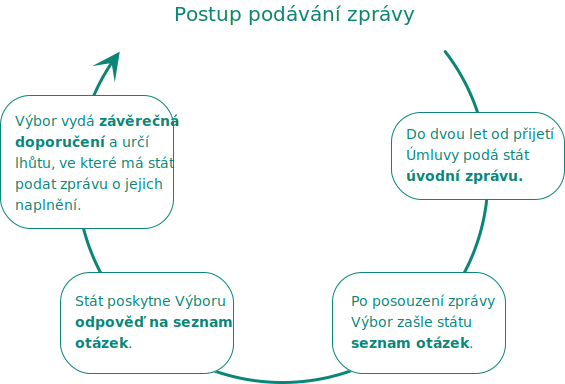
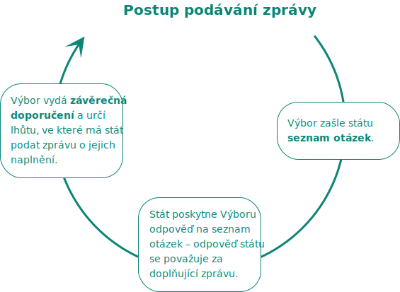

Za tímto účelem provádíme výzkumy, šetření a vypracováváme doporučení ke zlepšení situace lidí s postižením. Intenzivně přitom spolupracujeme právě s lidmi s postižením a s neziskovými organizacemi.

Naše činnost vychází z poznatků z praxe. Ombudsman má poradní orgán složený z lidí s postižením nebo lidí hájících práva lidí s postižením. Úkolem poradního orgánu je získávat podněty poukazující na systémové problémy, pomáhat při stanovování priorit a doporučení, stanovovat témata, kterým je třeba se v oblasti práv osob s postižením věnovat. Poradní orgán také zajišťuje informovanost lidí s postižením o činnosti ombudsmana.


Za účelem zapojení lidí s postižením do sledování naplňování Úmluvy na vnitrostátní úrovni zřizuje ombudsman Poradní orgán.

Poradní orgán

- **předkládá** ombudsmanovi **systémová témata** v oblasti ochrany práv lidí s postižením,
- **poskytuje** ombudsmanovi **konzultace** a praktické informace,
- podílí se na **připomínkování právních předpisů** ombudsmanem a zaujímá stanoviska k jeho strategickým dokumentům týkajícím se práv lidí s postižením,
- **získává podněty** od lidí s postižením, organizací hájících jejich práva a od pečujících osob,
- **zajišťuje informovanost** lidí s postižením, organizací hájící jejich práva a široké veřejnosti o činnost ombudsmana v oblasti monitorování podle Úmluvy.

Poradní orgán má [19 členů](https://www.ochrance.cz/monitorovani-prav-lidi-se-zdravotnim-postizenim/poradni-organ/clenove/). Jeho členy jsou lidé s postižením a lidé hájící práva lidí s postižením. Při jmenování členů poradního orgánu přihlíží ombudsman zejména k jejich **odbornosti a angažovanosti v oblasti ochrany práv lidí s postižením**.


Výbor OSN pro práva osob se zdravotním postižením pravidelně vyhodnocuje situaci v jednotlivých zemích a případně adresuje státu doporučení ke zlepšení situace. Ombudsman Výboru poskytuje podklady a informuje ho o svých poznatcích, které pak Výbor zohlední při komunikaci s vládou České republiky a při formulování doporučení.

Výboru zasíláme monitorovací zprávu o plnění Úmluvy o právech osob se zdravotním postižením, která nejen mapuje současný stav pohledem ombudsmana, ale současně reaguje na zprávu České republiky. Vedle toho vypracováváme také seznam otázek. Tyto otázky může Výbor použít při sestavování vlastního tzv. List of Issues (seznam otázek), který by měla Česká republika zodpovědět.


Výbor OSN pro práva osob se zdravotním postižením (dále jen Výbor) byl zřízen Úmluvou pro účely **monitorování jejího naplňování** .

Má **[18 členů](https://www.ohchr.org/EN/HRBodies/CRPD/Pages/Membership.aspx)** , volí je smluvní státy Úmluvy. Úmluva vyžaduje, aby se jednalo o osoby s výraznými morálními kvalitami a současně odborníky v oblastech, na které se vztahuje. Smluvní státy by měly dbát také na spravedlivé zastoupení mužů a žen ze všech částí světa.

Výbor zasedá zpravidla dvakrát ročně, a to v Ženevě ve Švýcarsku. V současnosti je jeho předsedou **Danlami Umaru Basharu** z Nigérie.

### Pravomoci Výboru

Klíčovou úlohou Výboru je **posuzovat zprávy smluvních států** o plnění závazků z Úmluvy a  **vydávat doporučení** .

#### Cyklus podávání zpráv

1. do 2 let od přijetí Úmluvy podá stát **úvodní zprávu** ,
2. po posouzení zprávy Výbor zašle státu **seznam otázek** (List of Issues),
3. stát poskytne Výboru **odpověď na seznam otázek** (Reply to List of Issues),
4. Výbor vydá **závěrečná doporučení** (Concluding Observations) a určí lhůtu, ve které má stát podat zprávu o jejich naplnění (Follow-up).

Poté předkládá stát **každé 4 roky doplňující zprávy** . Pokud stá souhlasí, používá se **zjednodušená procedura** (simplified reporting procedure).

#### Zjednodušená procedura

1. Výbor zašle státu **seznam otázek**  (List of Issues prior to reporting),
2. stát poskytne Výboru **odpověď na seznam otázek**  – ta se považuje za doplňující zprávu,
3. Výbor vydá **závěrečná doporučení** (Concluding Observations) a určí lhůtu, ve které má stát podat zprávu o jejich naplnění (Follow-up).

### Pravomoci Výboru založené Opčním protokolem k Úmluvě 

Vůči státům, které přijaly Opční protokol k Úmluvě, má Výbor navíc tyto pravomoci:

1. může přijímat a prošetřovat **individuální stížnosti** na porušení Úmluvy,
2. **z vlastní iniciativy** může **prošetřit podezření** , že se smluvní stát dopouští závažného nebo systematického porušování Úmluvy.

### Vydávání obecných komentářů

Za účelem sjednocení výkladu Úmluvy vydává Výbor [obecné komentáře](https://www.ochrance.cz/monitorovani-prav-lidi-se-zdravotnim-postizenim/doporuceni-rozhodnuti-stanoviska/obecne-komentare/) k jednotlivým článkům Úmluvy.



Zajímá vás, o čem jsme Výbor OSN informovali? Podívejte se sem (TODO odkaz na Vyjádření pro mezinárodní orgány)

Naším cílem je posilovat přístupnost informací pro všechny bez rozdílu. Jako první a jediní v České republice jsme proto přeložili celou [Úmluvu OSN do znakového jazyka](/umluva/) a snažíme se zpřístupňovat informace [ve formě pro snadné čtení](mezinarodni_umluva_ETR.pdf).
